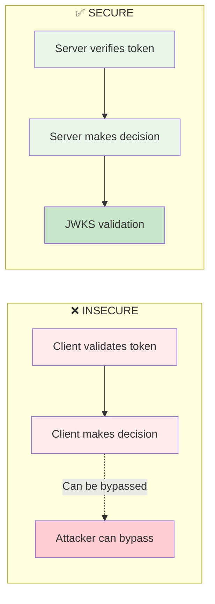
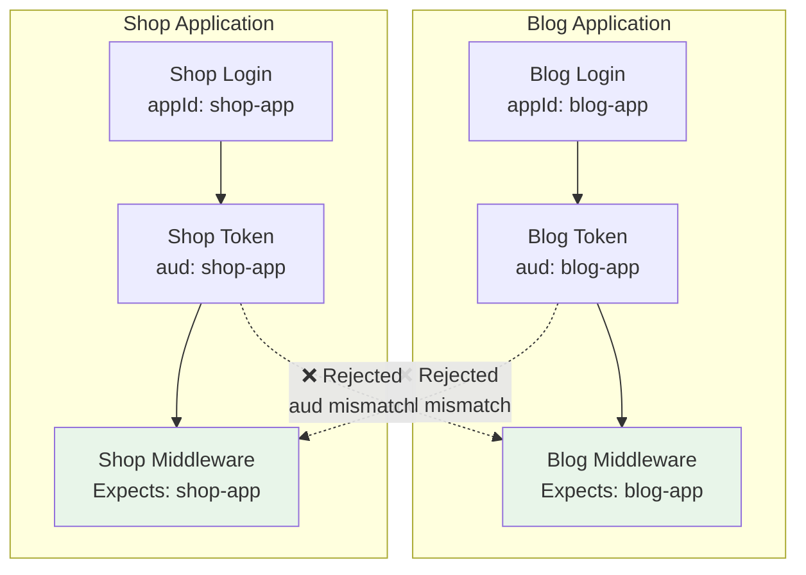

# TurKey SDK Middleware Implementation Guide

## Overview

This guide covers implementing secure JWT authentication middleware across different frameworks, with specific focus on Next.js Edge Runtime constraints and best practices.

## Table of Contents

- [Security Principles](#security-principles)
- [Next.js Middleware (Edge Runtime)](#nextjs-middleware-edge-runtime)
- [Express/Node.js Middleware](#expressnodejs-middleware)
- [Common Pitfalls](#common-pitfalls)
- [Architecture Patterns](#architecture-patterns)

## Security Principles

### The Golden Rule

**🔒 ALWAYS verify JWTs server-side. NEVER trust client-side validation for authorization.**



### Why Server-Side Verification Matters

1. **Client code can be modified** - Attackers can disable client-side checks
2. **JWKS validation is authoritative** - Server fetches current public keys
3. **App ID validation prevents token reuse** - Tokens scoped to specific apps
4. **Signature verification is cryptographic** - ES256 signatures can't be forged

## Next.js Middleware (Edge Runtime)

### Edge Runtime Constraints

Next.js middleware runs in the Edge Runtime, which has specific limitations:

| Feature          | Available | Notes                          |
| ---------------- | --------- | ------------------------------ |
| React components | ❌        | Cannot import client-side code |
| Node.js APIs     | ❌        | No `fs`, `crypto`, etc.        |
| `jose` library   | ✅        | Edge-compatible JWT library    |
| `fetch` API      | ✅        | For JWKS retrieval             |
| Dynamic imports  | ✅        | Use for conditional loading    |

### Implementation Pattern

```typescript
// src/middleware.ts
import { NextRequest, NextResponse } from 'next/server'

/**
 * Inline JWT verification for edge runtime
 * Cannot import from SDK due to React context dependencies
 */
async function verifyJwt(
  token: string,
  config: { baseUrl: string; appId?: string }
) {
  const { baseUrl, appId } = config
  const jwksUrl = `${baseUrl}/.well-known/jwks.json`

  // Dynamic import for edge runtime compatibility
  const { jwtVerify, createRemoteJWKSet } = await import('jose')
  const JWKS = createRemoteJWKSet(new URL(jwksUrl))

  const { payload } = await jwtVerify(token, JWKS, {
    audience: appId,
  })

  return payload as {
    sub?: string
    email?: string
    role?: string
    aud?: string
  }
}

/**
 * Extract JWT token from request
 * Checks cookies first (browser apps), then Authorization header (API clients)
 */
function extractToken(request: NextRequest): string | null {
  // Try cookie (recommended for browser apps)
  const cookieToken = request.cookies.get('turkey_access_token')?.value
  if (cookieToken) return cookieToken

  // Try Authorization header (for API clients)
  const authHeader = request.headers.get('authorization')
  if (authHeader?.startsWith('Bearer ')) {
    return authHeader.slice(7)
  }

  return null
}

export async function middleware(request: NextRequest) {
  const path = request.nextUrl.pathname

  // Skip middleware for static assets and public routes
  if (
    path.startsWith('/_next/') ||
    path.startsWith('/auth/') ||
    path === '/login' ||
    path === '/register'
  ) {
    return NextResponse.next()
  }

  // Protect dashboard and API routes
  if (path.startsWith('/dashboard') || path.startsWith('/api/')) {
    const token = extractToken(request)

    if (!token) {
      return handleUnauthenticated(request, path.startsWith('/api/'))
    }

    try {
      // Verify JWT with JWKS from turkey server
      const payload = await verifyJwt(token, {
        baseUrl: process.env.TURKEY_BASE_URL!,
        appId: process.env.TURKEY_APP_ID,
      })

      // Attach user data to request headers for route handlers
      const response = NextResponse.next()
      response.headers.set('x-turkey-user-id', payload.sub || '')
      response.headers.set('x-turkey-user-email', payload.email || '')
      response.headers.set('x-turkey-user-role', payload.role || '')
      response.headers.set('x-turkey-app-id', payload.aud || '')

      return response
    } catch (error) {
      return handleUnauthenticated(request, path.startsWith('/api/'))
    }
  }

  return NextResponse.next()
}

function handleUnauthenticated(request: NextRequest, isApiRoute: boolean) {
  if (isApiRoute) {
    return new NextResponse(
      JSON.stringify({ error: 'Authentication required' }),
      {
        status: 401,
        headers: { 'content-type': 'application/json' },
      }
    )
  }

  const loginUrl = new URL('/auth/login', request.url)
  loginUrl.searchParams.set('redirect', request.nextUrl.pathname)
  return NextResponse.redirect(loginUrl)
}

export const config = {
  matcher: [
    /*
     * Match all request paths except:
     * - _next/static (static files)
     * - _next/image (image optimization)
     * - favicon.ico (favicon)
     */
    '/((?!_next/static|_next/image|favicon.ico).*)',
  ],
}
```

### Route Protection Pattern

**Important:** Next.js route groups like `(protected)` don't appear in URLs!

```
File structure:           URL path:
app/
  (protected)/
    dashboard/
      page.tsx           → /dashboard (NOT /(protected)/dashboard)
```

Create explicit route lists instead of pattern matching on folders:

```typescript
// src/config/routes.ts
export const protectedRoutes = ['/dashboard', '/profile', '/settings']
export const protectedApiRoutes = ['/api/user', '/api/data']

export function getRouteType(path: string): 'protected' | 'public' {
  if (protectedRoutes.some((route) => path.startsWith(route))) {
    return 'protected'
  }
  return 'public'
}
```

### Environment Variables

```bash
# Server-side (for middleware and API routes)
TURKEY_BASE_URL=http://localhost:3000
TURKEY_APP_ID=my-app  # Optional: validates aud claim

# Client-side (for browser SDK usage)
NEXT_PUBLIC_TURKEY_BASE_URL=http://localhost:3000
NEXT_PUBLIC_TURKEY_AUDIENCE=my-app
```

**Critical:** Environment variables without `NEXT_PUBLIC_` are server-only. Dev server must be restarted when changing `.env.local`.

### Accessing User Data in Route Handlers

```typescript
// app/api/profile/route.ts
import { headers } from 'next/headers'

export async function GET() {
  const headersList = headers()

  const userId = headersList.get('x-turkey-user-id')
  const userEmail = headersList.get('x-turkey-user-email')
  const userRole = headersList.get('x-turkey-user-role')

  if (!userId) {
    return Response.json({ error: 'Unauthorized' }, { status: 401 })
  }

  return Response.json({ userId, userEmail, userRole })
}
```

## Express/Node.js Middleware

### Direct JWT Verification

```typescript
import express from 'express'
import { verifyJwt } from '@jimmyjames88/turkey-sdk'

const app = express()

app.use(async (req, res, next) => {
  try {
    const authHeader = req.headers.authorization || ''
    if (!authHeader.startsWith('Bearer ')) {
      return res.status(401).json({ error: 'Missing token' })
    }

    const token = authHeader.slice(7)

    // ✅ Secure server-side verification
    const payload = await verifyJwt(token, {
      baseUrl: process.env.TURKEY_BASE_URL!,
      appId: process.env.TURKEY_APP_ID,
    })

    req.user = payload
    next()
  } catch (err) {
    res.status(401).json({ error: 'Invalid token' })
  }
})
```

### Token Extraction Strategies

```typescript
function extractToken(req: express.Request): string | null {
  // 1. Authorization header (recommended for APIs)
  const authHeader = req.headers.authorization
  if (authHeader?.startsWith('Bearer ')) {
    return authHeader.slice(7)
  }

  // 2. Cookie (for browser apps)
  const cookieToken = req.cookies?.turkey_access_token
  if (cookieToken) {
    return cookieToken
  }

  // 3. Custom header (if needed)
  const customHeader = req.headers['x-access-token']
  if (customHeader && typeof customHeader === 'string') {
    return customHeader
  }

  return null
}
```

## Common Pitfalls

### 1. Trusting Client-Side Validation

❌ **WRONG:**

```typescript
// Client side
const payload = await client.validateTokenFormat(token)
if (payload.role === 'admin') {
  // Show admin dashboard
  showAdminDashboard() // Attacker can bypass this!
}
```

✅ **CORRECT:**

```typescript
// Client side - UI decision only
const payload = await client.validateTokenFormat(token)
if (payload.role === 'admin') {
  showAdminButton() // UI hint only
}

// Server side - actual authorization
app.get('/api/admin', async (req, res) => {
  const payload = await verifyJwt(token, config) // Real verification
  if (payload.role !== 'admin') {
    return res.status(403).json({ error: 'Forbidden' })
  }
  // Return admin data
})
```

### 2. Importing SDK in Edge Runtime

❌ **WRONG:**

```typescript
// middleware.ts
import { verifyJwt } from '@jimmyjames88/turkey-sdk' // Fails!
// Error: createContext is not a function
```

✅ **CORRECT:**

```typescript
// middleware.ts
// Use inline verification with jose library
const { jwtVerify, createRemoteJWKSet } = await import('jose')
```

### 3. Route Group URL Matching

❌ **WRONG:**

```typescript
// Checking for route groups in URL
if (path.includes('/(protected)/')) {
  // This will NEVER match!
}
```

✅ **CORRECT:**

```typescript
// Check actual URL paths
const protectedRoutes = ['/dashboard', '/profile']
if (protectedRoutes.some((route) => path.startsWith(route))) {
  // This works correctly
}
```

### 4. Missing Environment Variables

❌ **WRONG:**

```typescript
// Using client-side env vars in middleware
const baseUrl = process.env.NEXT_PUBLIC_TURKEY_BASE_URL // undefined!
```

✅ **CORRECT:**

```typescript
// Use server-side env vars
const baseUrl = process.env.TURKEY_BASE_URL // Works!
```

### 5. Forgetting App ID Validation

❌ **RISKY:**

```typescript
// Accepting tokens from any app
const payload = await jwtVerify(token, JWKS) // No aud check!
```

✅ **SECURE:**

```typescript
// Validate app ID (aud claim)
const payload = await jwtVerify(token, JWKS, {
  audience: 'my-specific-app', // Rejects tokens for other apps
})
```

## Architecture Patterns

### Multi-App Token Isolation



**Benefits:**

- Token from blog-app cannot access shop-app
- Compromised token has limited blast radius
- Clear security boundaries between applications

### Progressive Enhancement Pattern

Start with no auth, gradually add protection:

```typescript
export function getRouteType(path: string) {
  // Phase 1: Public by default
  if (path.startsWith('/dashboard')) return 'protected'
  return 'public'

  // Phase 2: Add more protected routes
  // if (path.startsWith('/profile')) return 'protected'

  // Phase 3: Add role-based protection
  // if (path.startsWith('/admin')) return 'admin-only'
}
```

## Testing Middleware

### Testing Protected Routes

```bash
# Without token - should redirect/401
curl -i http://localhost:3001/dashboard
# Expected: HTTP 307 Redirect or 401

# With valid token - should succeed
curl -i -H "Cookie: turkey_access_token=eyJhbG..." http://localhost:3001/dashboard
# Expected: HTTP 200 OK with x-turkey-* headers

# With invalid token - should redirect/401
curl -i -H "Cookie: turkey_access_token=invalid" http://localhost:3001/dashboard
# Expected: HTTP 307 Redirect or 401
```

### Verifying User Headers

```bash
curl -i -H "Cookie: turkey_access_token=eyJhbG..." http://localhost:3001/dashboard | grep x-turkey
# Expected output:
# x-turkey-user-id: uuid
# x-turkey-user-email: user@example.com
# x-turkey-user-role: user
# x-turkey-app-id: my-app
```

## Lessons Learned

### Edge Runtime Compatibility

1. **Cannot import React code** - Edge runtime is Node.js-like but restricted
2. **Use dynamic imports for jose** - Ensures edge compatibility
3. **Inline critical functions** - Don't rely on SDK exports in middleware

### Next.js Specific

1. **Route groups are filesystem-only** - URLs don't include `(groupName)`
2. **Environment variables matter** - Server vs client prefixes
3. **Matcher patterns are critical** - Overly broad matchers slow down app
4. **Dev server restart required** - For environment variable changes

### Security

1. **Always verify server-side** - Client validation is UI-only
2. **App ID validation is crucial** - Prevents cross-app token reuse
3. **JWKS caching is automatic** - jose library handles it
4. **Token extraction order matters** - Cookie first for browser, header for API

## Migration Checklist

Moving from basic auth to TurKey middleware:

- [ ] Set up TurKey server with JWKS endpoint
- [ ] Configure environment variables (`TURKEY_BASE_URL`, `TURKEY_APP_ID`)
- [ ] Implement inline JWT verification in middleware
- [ ] Create route protection configuration
- [ ] Test unauthenticated access (should redirect/401)
- [ ] Test with valid token (should allow access + attach headers)
- [ ] Test with invalid/expired token (should reject)
- [ ] Verify user headers in route handlers
- [ ] Update client-side code to use SDK
- [ ] Remove old authentication logic
- [ ] Document environment variable requirements
- [ ] Update deployment configuration

## Additional Resources

- [TurKey SDK README](./README.md)
- [Next.js Middleware Example](./examples/middleware/next.ts)
- [Express Middleware Example](./examples/middleware/express.ts)
- [Security Best Practices](https://jwt.io/introduction)
