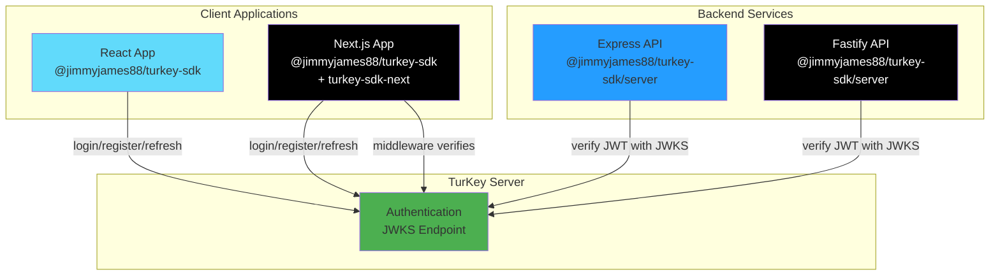

# TurKey SDK Monorepo

Authentication SDK for TurKey JWT service with framework-specific integrations.

## Packages

### [@jimmyjames88/turkey-sdk](./packages/turkey-sdk)

Core TypeScript SDK with React hooks, server-side verification, and Express/Node.js middleware.

```bash
npm install @jimmyjames88/turkey-sdk
```

**[📚 Full Documentation →](./packages/turkey-sdk/README.md)**

**Features:**

- 🔐 Complete authentication flow (login, register, refresh, logout)
- ⚛️ React hooks and context providers
- 🍪 Flexible storage backends (cookies, localStorage, memory)
- 🛡️ Server-side JWT verification with JWKS
- 🔧 Express/Fastify/Koa middleware helpers
- 📦 ESM and CommonJS support

---

### [@jimmyjames88/turkey-sdk-next](./packages/turkey-sdk-next)

Next.js middleware with Edge Runtime support and zero-configuration setup.

```bash
npm install @jimmyjames88/turkey-sdk-next
```

**[📚 Full Documentation →](./packages/turkey-sdk-next/README.md)**

**Features:**

- ✅ Zero-config with sensible defaults
- ⚡ Edge Runtime compatible
- 🎯 Automatic route detection
- 🔐 Auth-only routes (redirect if authenticated)
- 🛡️ Smart API error handling (401 JSON vs redirects)
- 🐛 Development logging

---

## Quick Start

### Choose Your Package

- **React/Node.js apps** → Use \`@jimmyjames88/turkey-sdk\`
- **Next.js apps** → Use both \`@jimmyjames88/turkey-sdk\` (client) + \`@jimmyjames88/turkey-sdk-next\` (middleware)

### React Application

```typescript
import { TurKeyClient, AuthProvider, useTurkey } from '@jimmyjames88/turkey-sdk'
import { CookieTokenStorage } from '@jimmyjames88/turkey-sdk/storage'

const client = new TurKeyClient({
  baseUrl: 'http://localhost:3000',
  appId: 'my-app',
})

const storage = new CookieTokenStorage()

function App() {
  return (
    <AuthProvider client={client} storage={storage}>
      <Dashboard />
    </AuthProvider>
  )
}

function Dashboard() {
  const { user, login, logout } = useTurkey()

  if (!user) {
    return <button onClick={() => login({ email, password })}>Login</button>
  }

  return <div>Welcome {user.email}!</div>
}
```

### Next.js Application

```typescript
// src/middleware.ts
import { createTurKeyMiddleware } from '@jimmyjames88/turkey-sdk-next'

export const middleware = createTurKeyMiddleware({
  baseUrl: process.env.TURKEY_BASE_URL!,
  appId: process.env.TURKEY_APP_ID!,
})

export const config = {
  matcher: ['/((?!_next/static|_next/image|favicon.ico).*)'],
}
```

### Express Server

```typescript
import { verifyJwt } from '@jimmyjames88/turkey-sdk/server'

app.use('/api/protected', async (req, res, next) => {
  try {
    const token = req.headers.authorization?.slice(7) // Remove 'Bearer '
    const payload = await verifyJwt(token, {
      baseUrl: process.env.TURKEY_BASE_URL,
      appId: process.env.TURKEY_APP_ID,
    })
    req.user = payload
    next()
  } catch (error) {
    res.status(401).json({ error: 'Unauthorized' })
  }
})
```

---

## Architecture



---

## Development

### Setup

```bash
# Install dependencies
npm install

# Build all packages
npm run build

# Build specific package
npm run build:sdk
npm run build:next

# Run tests
npm test
npm run test:sdk
npm run test:next

# Watch mode for development
npm run dev
```

### Workspace Structure

```
turkey-sdk/
├── packages/
│   ├── turkey-sdk/           # Core SDK
│   │   ├── src/
│   │   ├── README.md         # Full SDK documentation
│   │   └── package.json
│   └── turkey-sdk-next/      # Next.js wrapper
│       ├── src/
│       ├── README.md         # Full Next.js docs
│       └── package.json
└── package.json              # Monorepo root
```

---

## Related Projects

- **[turkey](https://github.com/jimmyjames88/turkey)** - TurKey authentication server with JWKS, refresh rotation, and multi-app support
- **[renoodles-next](https://github.com/jimmyjames88/renoodles-next)** - Example Next.js application demonstrating SDK integration

---

## Publishing

Packages are published independently:

```bash
# Publish core SDK
cd packages/turkey-sdk
npm publish

# Publish Next.js wrapper
cd packages/turkey-sdk-next
npm publish
```

---

## License

MIT
