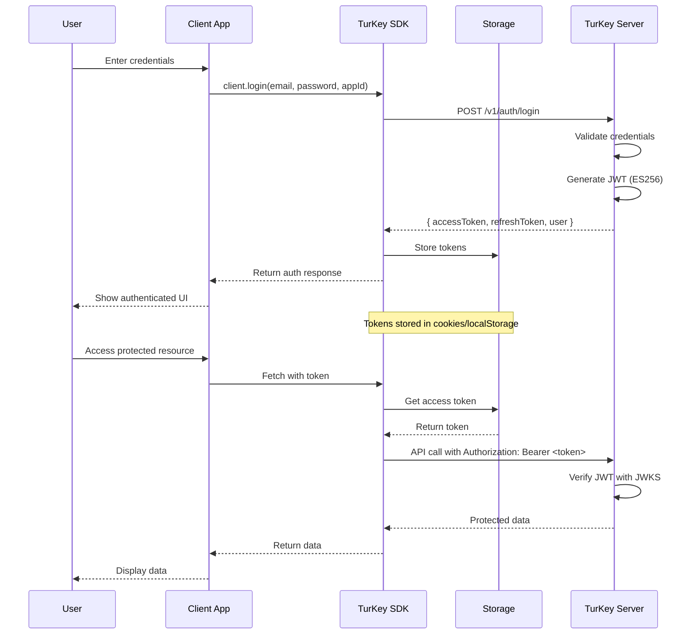
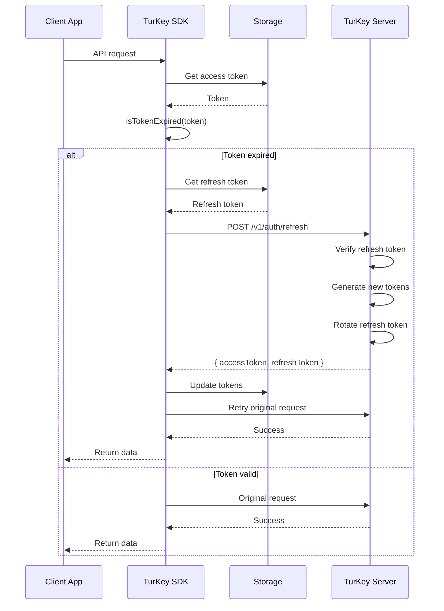
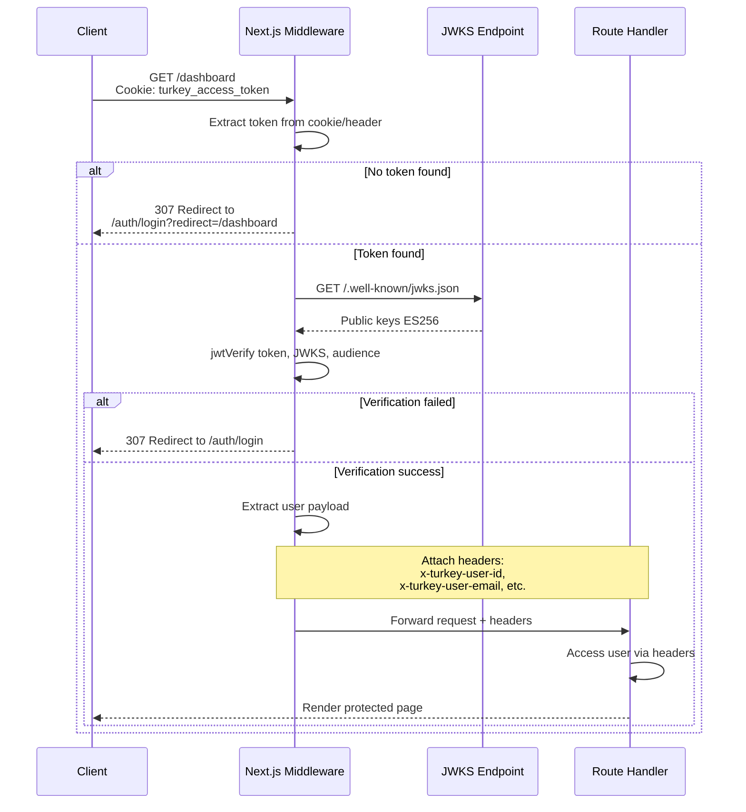
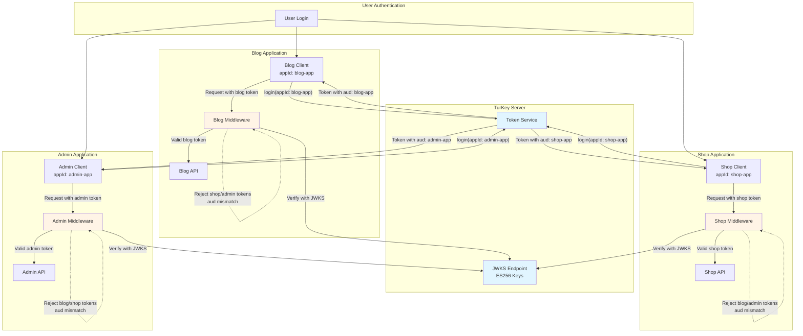
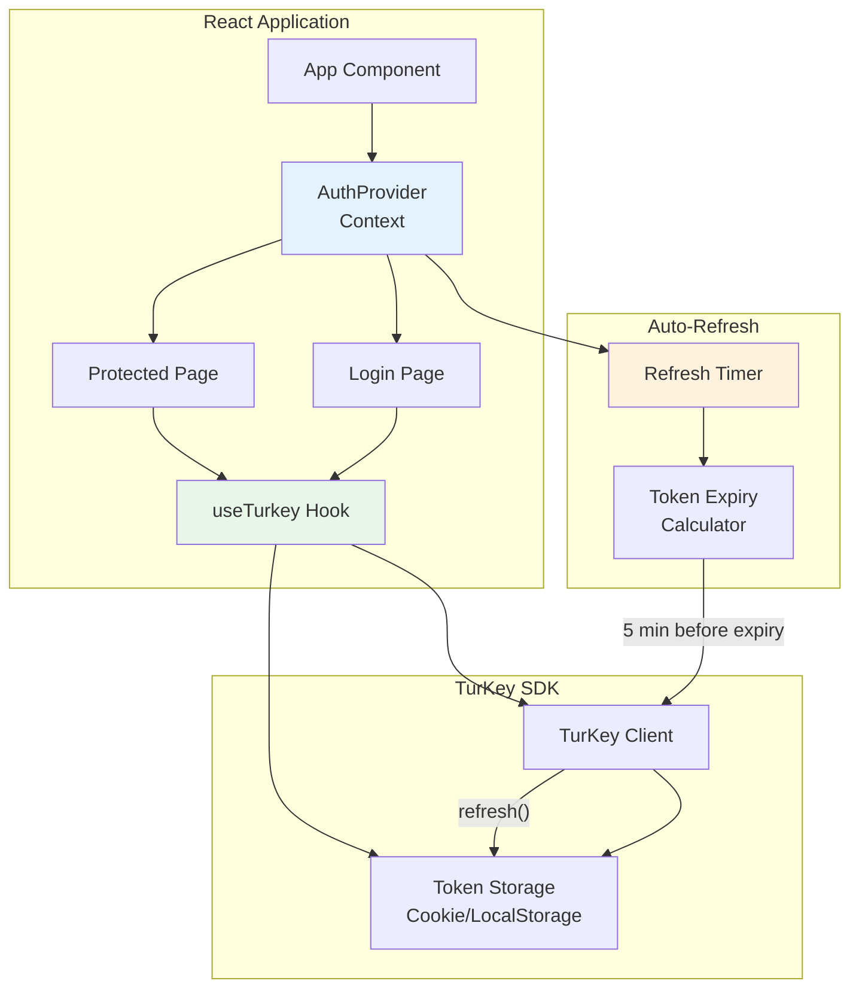
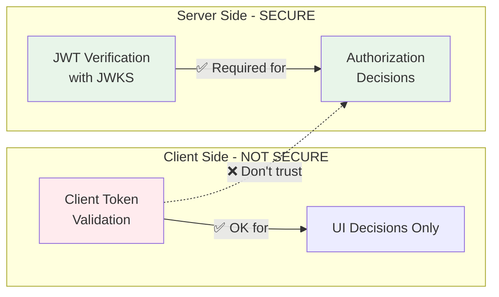

# TurKey SDK

A TypeScript SDK for seamless integration with TurKey JWT authentication service.

## 📚 Documentation

- **[README](./README.md)** - This file: Quick start, API reference, examples
- **[Middleware Guide](./MIDDLEWARE-GUIDE.md)** - Comprehensive middleware implementation guide with security best practices
- **[Examples](./examples/)** - Working code examples for various frameworks

## Features

- 🔐 **Complete Authentication Flow** - Login, register, refresh, logout
- 🎯 **App-Specific Tokens** - Token isolation between applications
- ⚡ **TypeScript First** - Full type safety and IntelliSense
- 🍪 **Flexible Storage** - Cookie, localStorage, or memory storage
- ⚛️ **React Integration** - Ready-to-use hooks and providers
- 🛡️ **JWT Verification** - ES256 signature verification with JWKS
- � **Server Middleware** - Zero-config authentication middleware
- �📦 **Multiple Formats** - ESM and CommonJS builds
- 🧪 **Well Tested** - Comprehensive test suite

## Architecture Overview

The TurKey SDK provides a complete authentication solution spanning client applications, backend services, and the TurKey authentication server.

### Authentication Flow



### Token Refresh Flow



### Server Middleware Verification



### Multi-App Token Architecture



### React Integration Architecture



### Edge Runtime Middleware (Next.js)

````mermaid
graph LR
    subgraph NextJS["Next.js Application"]
        MW["middleware.ts<br/>Edge Runtime"]
        Route["Route Handler<br/>Node.js Runtime"]
    end

    subgraph TokenVerification["Token Verification"]
        Extract["extractToken()<br/>Cookie/Header"]
        Verify["verifyJwt()<br/>jose library"]
        JWKS["JWKS Fetch<br/>Edge Compatible"]
    end

    subgraph Constraints["Constraints"]
        C1["❌ No React imports"]
        C2["❌ No Node.js APIs"]
        C3["✅ jose library OK"]
        C4["✅ fetch API OK"]
    end

    MW --> Extract
    Extract --> Verify
    Verify --> JWKS

    MW -.->|"Can't import"| C1
    MW -.->|"Can't use"| C2
    MW -.->|"Can use"| C3
    MW -.->|"Can use"| C4

    Verify -->|Success| Route
    Verify -->|Failure| Redirect["307 Redirect<br/>/auth/login"]

    Route -->|"Access via"| Headers["x-turkey-user-id<br/>x-turkey-user-email<br/>x-turkey-user-role"]

    style MW fill:#f3e5f5
    style Verify fill:#e1f5ff
    style C1 fill:#ffebee
    style C2 fill:#ffebee
    style C3 fill:#e8f5e9
    style C4 fill:#e8f5e9
```## Installation

```bash
npm install @jimmyjames88/turkey-sdk
````

## Quick Start

### Basic Usage

```typescript
import { TurKeyClient, CookieTokenStorage } from '@jimmyjames88/turkey-sdk'

const client = new TurKeyClient({
  baseUrl: 'https://auth.yourapp.com',
  appId: 'my-app',
})

// Login
const { user, accessToken, refreshToken } = await client.login({
  email: 'user@example.com',
  password: 'securepassword',
})

// Store tokens
const storage = new CookieTokenStorage()
storage.setTokens(accessToken, refreshToken)

// Verify tokens
const isValid = await client.verifyToken(accessToken)
const userInfo = client.getUserFromToken(accessToken)
```

### React Integration

```tsx
import { TurKeyClient, AuthProvider, useTurkey } from '@jimmyjames88/turkey-sdk'

function App() {
  const client = new TurKeyClient({
    baseUrl: 'https://auth.yourapp.com',
    appId: 'my-app',
  })

  return (
    <AuthProvider client={client}>
      <LoginComponent />
    </AuthProvider>
  )
}

function LoginComponent() {
  const { login, user, isAuthenticated } = useTurkey()

  if (isAuthenticated) {
    return <div>Welcome, {user?.email}!</div>
  }

  return (
    <button
      onClick={() => login({ email: 'user@example.com', password: 'pass' })}
    >
      Login
    </button>
  )
}
```

### Server Middleware (Zero Configuration)

Protect your API routes with minimal setup using environment-based configuration:

```typescript
// Set environment variables
// TURKEY_BASE_URL=https://your-turkey-server.com
// TURKEY_APP_ID=my-app

import { turkeyAuth } from '@jimmyjames88/turkey-sdk/middleware'
import express from 'express'

const app = express()

// Zero-config authentication - uses environment variables
app.use('/api', turkeyAuth())

// Your protected routes automatically have req.user
app.get('/api/profile', (req, res) => {
  res.json({
    user: req.user, // ✅ Fully typed user object
    message: `Hello ${req.user.email}!`,
  })
})

// Optional authentication for public endpoints
import { optionalAuth } from '@jimmyjames88/turkey-sdk/middleware'
app.use('/api/public', optionalAuth())

app.get('/api/public/stats', (req, res) => {
  if (req.user) {
    res.json({ message: `Personalized stats for ${req.user.email}` })
  } else {
    res.json({ message: 'General stats for anonymous user' })
  }
})
```

#### Framework Compatibility

The core middleware works with **any Node.js framework**:

```typescript
import { createTurkeyMiddleware } from '@jimmyjames88/turkey-sdk/middleware'

// Fastify
const middleware = createTurkeyMiddleware()
fastify.addHook('preHandler', middleware)

// Koa
app.use(async (ctx, next) => {
  await middleware(ctx.request, ctx.response, next)
})

// Hapi, NestJS, etc. - works with any framework
```

## API Reference

### TurKeyClient

The main client for interacting with TurKey authentication service.

#### Constructor

```typescript
new TurKeyClient(config: TurKeyConfig)
```

#### Methods

##### Authentication Methods

###### `login(params: LoginParams): Promise<AuthResponse>`

Authenticate a user with email/password credentials.

**Parameters:**

```typescript
interface LoginParams {
  email: string // User's email address
  password: string // User's password
  appId?: string // Optional app identifier for app-specific tokens
}
```

**Returns:**

```typescript
interface AuthResponse {
  user: {
    id: string
    email: string
    role: string
  }
  accessToken: string // JWT access token
  refreshToken: string // JWT refresh token
  expiresIn: number // Token expiration time in seconds
  tokenType: string // Token type (usually "Bearer")
}
```

**Example:**

```typescript
try {
  const response = await client.login({
    email: 'user@example.com',
    password: 'securepassword',
  })

  console.log('Logged in user:', response.user)
  // Store tokens securely
  storage.setTokens(response.accessToken, response.refreshToken)
} catch (error) {
  console.error('Login failed:', error.message)
}
```

---

###### `register(params: RegisterParams): Promise<AuthResponse>`

Register a new user account.

**Parameters:**

```typescript
interface RegisterParams {
  email: string // User's email address
  password: string // User's password
  role?: 'user' | 'admin' // User role (default: 'user')
  appId?: string // Optional app identifier for app-specific tokens
}
```

**Returns:** Same as `login()` - `AuthResponse`

**Example:**

```typescript
try {
  const response = await client.register({
    email: 'newuser@example.com',
    password: 'securepassword',
    role: 'user',
    appId: 'my-app', // Optional: for app-specific tokens
  })

  console.log('User registered:', response.user)
} catch (error) {
  console.error('Registration failed:', error.message)
}
```

---

###### `refresh(params: RefreshParams): Promise<AuthResponse>`

Refresh an expired access token using a refresh token.

**Parameters:**

```typescript
interface RefreshParams {
  refreshToken: string // Valid refresh token
  appId?: string // Optional appId for app-specific tokens
}
```

**Returns:** `AuthResponse` with new tokens

**Example:**

```typescript
try {
  const response = await client.refresh({
    refreshToken: storage.getRefreshToken(),
  })

  // Update stored tokens
  storage.setTokens(response.accessToken, response.refreshToken)
} catch (error) {
  // Refresh token expired, redirect to login
  console.error('Token refresh failed:', error.message)
  redirectToLogin()
}
```

---

###### `logout(accessToken: string): Promise<void>`

Logout the current session, invalidating the access token.

**Parameters:**

- `accessToken: string` - Current access token to invalidate

**Example:**

```typescript
try {
  await client.logout(storage.getAccessToken())
  storage.clearTokens()
  console.log('Logged out successfully')
} catch (error) {
  console.error('Logout failed:', error.message)
}
```

---

###### `logoutAll(accessToken: string): Promise<void>`

Logout all sessions for the current user, invalidating all tokens.

**Parameters:**

- `accessToken: string` - Current access token

**Example:**

```typescript
try {
  await client.logoutAll(storage.getAccessToken())
  storage.clearTokens()
  console.log('Logged out from all devices')
} catch (error) {
  console.error('Logout all failed:', error.message)
}
```

---

##### Token Verification Methods

###### `validateTokenFormat(token: string, appId?: string): Promise<JWTPayload>`

Client-side token format validation for UI purposes only.

⚠️ **WARNING: This is NOT secure for authorization decisions!**
⚠️ **Always use server-side `verifyJwt()` for auth/authz.**

**Use cases:**

- Validating token format before sending to server
- Client-side error handling and user feedback
- Development/debugging token issues

**Parameters:**

- `token: string` - JWT token to validate
- `appId?: string` - Optional app ID to verify (defaults to client's appId)

**Returns:**

```typescript
interface JWTPayload {
  sub: string // Subject (user ID)
  email: string // User email
  role: string // User role
  scope?: string // Token scope
  aud: string // App ID
  iss: string // Issuer
  exp: number // Expiration timestamp
  iat: number // Issued at timestamp
}
```

**Example:**

```typescript
try {
  // ✅ Good: Format validation for UX
  const payload = await client.validateTokenFormat(accessToken)
  console.log('Token format is valid, user:', payload.email)

  // ❌ Bad: Don't use for security decisions!
  // if (payload.role === 'admin') { return adminData } // Insecure!
} catch (error) {
  console.error('Token format validation failed:', error.message)
  showLoginForm() // UX decision only
}
```

---

###### `verifyToken(token: string, appId?: string): Promise<JWTPayload>` ⚠️ **DEPRECATED**

**This method is deprecated and will be removed in v1.0.0. Use `validateTokenFormat()` instead.**

This method name is misleading as it suggests security when it's only format validation.

---

###### `decodeToken(token: string): JWTPayload`

Decode a JWT token without verifying its signature (use with caution).

**Parameters:**

- `token: string` - JWT token to decode

**Returns:** `JWTPayload` (unverified)

**Example:**

```typescript
try {
  const payload = client.decodeToken(accessToken)
  console.log('Token claims:', payload)
  // Note: This does NOT verify the token signature
} catch (error) {
  console.error('Token decode failed:', error.message)
}
```

---

###### `getUserFromToken(token: string): User`

Extract user information from a JWT token without verification.

**Parameters:**

- `token: string` - JWT token

**Returns:**

```typescript
interface User {
  id: string
  email: string
  role: string
}
```

**Example:**

```typescript
try {
  const user = client.getUserFromToken(accessToken)
  console.log('Current user:', user)
} catch (error) {
  console.error('Failed to extract user:', error.message)
}
```

---

###### `isTokenExpired(token: string): boolean`

Check if a JWT token is expired based on its `exp` claim.

**Parameters:**

- `token: string` - JWT token to check

**Returns:** `boolean` - `true` if expired, `false` if valid

**Example:**

```typescript
const accessToken = storage.getAccessToken()

if (client.isTokenExpired(accessToken)) {
  console.log('Token expired, refreshing...')
  await client.refresh({ refreshToken: storage.getRefreshToken() })
} else {
  console.log('Token is still valid')
}
```

---

###### `getTimeUntilExpiry(token: string): number`

Get the number of seconds until a token expires.

**Parameters:**

- `token: string` - JWT token

**Returns:** `number` - Seconds until expiration (negative if already expired)

**Example:**

```typescript
const accessToken = storage.getAccessToken()
const secondsLeft = client.getTimeUntilExpiry(accessToken)

if (secondsLeft > 0) {
  console.log(`Token expires in ${secondsLeft} seconds`)

  if (secondsLeft < 300) {
    // Less than 5 minutes
    console.log('Token expiring soon, consider refreshing')
  }
} else {
  console.log('Token has already expired')
}
```

### Storage Options

#### CookieTokenStorage (Recommended)

```typescript
const storage = new CookieTokenStorage({
  secure: true,
  sameSite: 'strict',
  domain: '.yourapp.com',
})
```

#### LocalStorageTokenStorage

```typescript
const storage = new LocalStorageTokenStorage()
```

#### MemoryTokenStorage

```typescript
const storage = new MemoryTokenStorage()
```

### React Hooks

#### useTurkey()

Primary hook for authentication state and actions.

```typescript
const {
  user, // Current user info
  isAuthenticated, // Authentication status
  isLoading, // Loading state
  login, // Login function
  register, // Register function
  logout, // Logout function
  refreshTokens, // Manual refresh
  client, // TurKey client instance
} = useTurkey()
```

#### useAccessToken()

Get current access token from storage.

```typescript
const accessToken = useAccessToken(storage)
```

#### useAuthenticatedFetch()

Fetch wrapper that automatically includes auth headers.

```typescript
const authenticatedFetch = useAuthenticatedFetch(storage)
const response = await authenticatedFetch('/api/protected-endpoint')
```

## App-Specific Tokens

TurKey supports app-specific tokens for enhanced security:

```typescript
// Different apps request tokens with different app IDs
const blogClient = new TurKeyClient({
  baseUrl: 'https://auth.yourapp.com',
  appId: 'blog-app',
})

const shopClient = new TurKeyClient({
  baseUrl: 'https://auth.yourapp.com',
  appId: 'shop-app',
})

// Tokens are isolated - blog tokens won't work for shop
const blogToken = await blogClient.login({ ... })
const shopToken = await shopClient.login({ ... })
```

## Server-Side JWT Verification

**🔒 CRITICAL SECURITY REQUIREMENT:**

**Client-side token validation is NOT secure for authorization!** Always use server-side verification for any security decisions.

📖 **For comprehensive middleware implementation guidance, see [MIDDLEWARE-GUIDE.md](./MIDDLEWARE-GUIDE.md)**

### The Security Boundary



### Server-Side Verification Methods

#### Direct JWT Verification

```typescript
import { verifyJwt } from '@jimmyjames88/turkey-sdk'

const app = express()

app.use(async (req, res, next) => {
  try {
    const authHeader = req.headers.authorization || ''
    if (!authHeader.startsWith('Bearer ')) {
      return res.status(401).json({ error: 'Missing token' })
    }

    const token = authHeader.slice(7)

    // ✅ This is the ONLY secure way to verify tokens
    const payload = await verifyJwt(token, {
      baseUrl: process.env.TURKEY_BASE_URL!,
      appId: process.env.TURKEY_APP_ID, // Optional: validates aud claim
    })

    req.user = payload // Attach verified user to request
    next()
  } catch (err) {
    res.status(401).json({ error: 'Invalid token' })
  }
})
```

#### Next.js Middleware (Edge Runtime)

For Next.js applications, middleware runs in the Edge Runtime with specific constraints:

**Edge Runtime Limitations:**

- ❌ Cannot import React components or client-side code
- ❌ Cannot use Node.js-specific modules
- ✅ Can use `jose` library for JWT verification
- ✅ Can use `fetch` API for JWKS retrieval

```typescript
// src/middleware.ts
import { NextRequest, NextResponse } from 'next/server'

// Inline JWT verification for edge runtime compatibility
async function verifyJwt(
  token: string,
  config: { baseUrl: string; appId?: string }
) {
  const { baseUrl, appId } = config
  const jwksUrl = `${baseUrl}/.well-known/jwks.json`

  // Dynamic import for edge runtime
  const { jwtVerify, createRemoteJWKSet } = await import('jose')
  const JWKS = createRemoteJWKSet(new URL(jwksUrl))

  const { payload } = await jwtVerify(token, JWKS, {
    audience: appId,
  })

  return payload as {
    sub?: string
    email?: string
    role?: string
    aud?: string
  }
}

function extractToken(request: NextRequest): string | null {
  // Try cookie first (browser apps)
  const cookieToken = request.cookies.get('turkey_access_token')?.value
  if (cookieToken) return cookieToken

  // Try Authorization header (API clients)
  const authHeader = request.headers.get('authorization')
  if (authHeader?.startsWith('Bearer ')) {
    return authHeader.slice(7)
  }

  return null
}

export async function middleware(request: NextRequest) {
  const path = request.nextUrl.pathname

  // Skip public routes
  if (path.startsWith('/auth/') || path.startsWith('/_next/')) {
    return NextResponse.next()
  }

  // Protect dashboard and API routes
  if (path.startsWith('/dashboard') || path.startsWith('/api/')) {
    const token = extractToken(request)

    if (!token) {
      if (path.startsWith('/api/')) {
        return new NextResponse(
          JSON.stringify({ error: 'Authentication required' }),
          { status: 401, headers: { 'content-type': 'application/json' } }
        )
      }

      const loginUrl = new URL('/auth/login', request.url)
      loginUrl.searchParams.set('redirect', path)
      return NextResponse.redirect(loginUrl)
    }

    try {
      // Verify JWT with JWKS
      const payload = await verifyJwt(token, {
        baseUrl: process.env.TURKEY_BASE_URL!,
        appId: process.env.TURKEY_APP_ID,
      })

      // Attach user data to request headers
      const response = NextResponse.next()
      response.headers.set('x-turkey-user-id', payload.sub || '')
      response.headers.set('x-turkey-user-email', payload.email || '')
      response.headers.set('x-turkey-user-role', payload.role || '')
      response.headers.set('x-turkey-app-id', payload.aud || '')

      return response
    } catch (error) {
      // Invalid token
      if (path.startsWith('/api/')) {
        return new NextResponse(
          JSON.stringify({ error: 'Invalid or expired token' }),
          { status: 401, headers: { 'content-type': 'application/json' } }
        )
      }

      const loginUrl = new URL('/auth/login', request.url)
      loginUrl.searchParams.set('redirect', path)
      return NextResponse.redirect(loginUrl)
    }
  }

  return NextResponse.next()
}

export const config = {
  matcher: ['/((?!_next/static|_next/image|favicon.ico).*)'],
}
```

**Accessing User Data in Route Handlers:**

```typescript
// app/api/profile/route.ts
import { headers } from 'next/headers'

export async function GET() {
  const headersList = headers()
  const userId = headersList.get('x-turkey-user-id')
  const userEmail = headersList.get('x-turkey-user-email')
  const userRole = headersList.get('x-turkey-user-role')

  return Response.json({ userId, userEmail, userRole })
}
```

**Environment Variables Required:**

```bash
# Server-side (for middleware and API routes)
TURKEY_BASE_URL=http://localhost:3000
TURKEY_APP_ID=my-app  # Optional: for aud claim validation

# Client-side (for browser SDK usage)
NEXT_PUBLIC_TURKEY_BASE_URL=http://localhost:3000
NEXT_PUBLIC_TURKEY_AUDIENCE=my-app
```

**Important Notes:**

1. Next.js route groups like `(protected)` don't appear in URLs
2. Middleware matcher patterns must account for actual URL paths, not filesystem structure
3. Environment variables without `NEXT_PUBLIC_` prefix are server-only
4. Dev server must be restarted when changing environment variables

## Error Handling

```typescript
import { TurKeyAuthError } from '@jimmyjames88/turkey-sdk'

try {
  await client.login({ ... })
} catch (error) {
  if (error instanceof TurKeyAuthError) {
    console.error('Auth failed:', error.message)
    console.error('Code:', error.code)
    console.error('Status:', error.statusCode)
    console.error('Details:', error.details)
  }
}
```

## Configuration

```typescript
interface TurKeyConfig {
  baseUrl: string // TurKey server URL
  appId?: string // Default app identifier for tokens
  timeout?: number // Request timeout (default: 10000ms)
}
```

## Development

```bash
# Install dependencies
npm install

# Build the SDK
npm run build

# Run tests
npm test

# Watch mode
npm run dev
```
