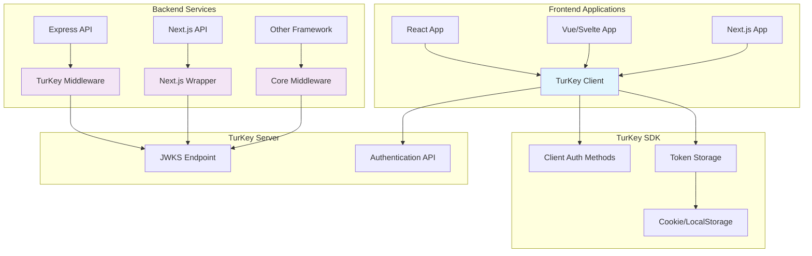
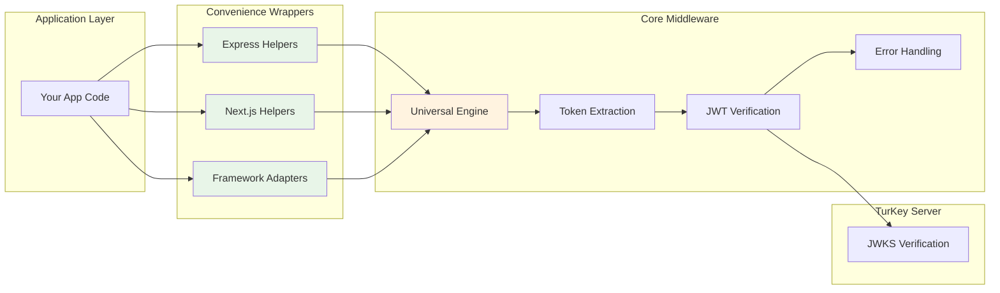

# TurKey SDK

A TypeScript SDK for seamless integration with TurKey JWT authentication service.

## Features

- 🔐 **Complete Authentication Flow** - Login, register, refresh, logout
- 🎯 **App-Specific Audiences** - Token isolation between applications
- ⚡ **TypeScript First** - Full type safety and IntelliSense
- 🍪 **Flexible Storage** - Cookie, localStorage, or memory storage
- ⚛️ **React Integration** - Ready-to-use hooks and providers
- 🛡️ **JWT Verification** - ES256 signature verification with JWKS
- � **Server Middleware** - Zero-config authentication middleware
- �📦 **Multiple Formats** - ESM and CommonJS builds
- 🧪 **Well Tested** - Comprehensive test suite

## Architecture Overview

### Full-Stack Authentication Flow



### Middleware Convenience Layers



## Installation

```bash
npm install @jimmyjames88/turkey-sdk
```

## Quick Start

### Basic Usage

```typescript
import { TurKeyClient, CookieTokenStorage } from '@jimmyjames88/turkey-sdk'

const client = new TurKeyClient({
  baseUrl: 'https://auth.yourapp.com',
  audience: 'my-app',
  tenantId: 'my-tenant',
})

// Login
const { user, accessToken, refreshToken } = await client.login({
  email: 'user@example.com',
  password: 'securepassword',
  tenantId: 'my-tenant',
})

// Store tokens
const storage = new CookieTokenStorage()
storage.setTokens(accessToken, refreshToken)

// Verify tokens
const isValid = await client.verifyToken(accessToken)
const userInfo = client.getUserFromToken(accessToken)
```

### React Integration

```tsx
import { TurKeyClient, AuthProvider, useTurkey } from '@jimmyjames88/turkey-sdk'

function App() {
  const client = new TurKeyClient({
    baseUrl: 'https://auth.yourapp.com',
    audience: 'my-app',
  })

  return (
    <AuthProvider client={client} tenantId="my-tenant">
      <LoginComponent />
    </AuthProvider>
  )
}

function LoginComponent() {
  const { login, user, isAuthenticated } = useTurkey()

  if (isAuthenticated) {
    return <div>Welcome, {user?.email}!</div>
  }

  return (
    <button
      onClick={() => login({ email: 'user@example.com', password: 'pass' })}
    >
      Login
    </button>
  )
}
```

### Server Middleware (Zero Configuration)

Protect your API routes with minimal setup using environment-based configuration:

```typescript
// Set environment variables
// TURKEY_BASE_URL=https://your-turkey-server.com
// TURKEY_AUDIENCE=my-app

import { turkeyAuth } from '@jimmyjames88/turkey-sdk/middleware'
import express from 'express'

const app = express()

// Zero-config authentication - uses environment variables
app.use('/api', turkeyAuth())

// Your protected routes automatically have req.user
app.get('/api/profile', (req, res) => {
  res.json({
    user: req.user, // ✅ Fully typed user object
    message: `Hello ${req.user.email}!`,
  })
})

// Optional authentication for public endpoints
import { optionalAuth } from '@jimmyjames88/turkey-sdk/middleware'
app.use('/api/public', optionalAuth())

app.get('/api/public/stats', (req, res) => {
  if (req.user) {
    res.json({ message: `Personalized stats for ${req.user.email}` })
  } else {
    res.json({ message: 'General stats for anonymous user' })
  }
})
```

#### Framework Compatibility

The core middleware works with **any Node.js framework**:

```typescript
import { createTurkeyMiddleware } from '@jimmyjames88/turkey-sdk/middleware'

// Fastify
const middleware = createTurkeyMiddleware()
fastify.addHook('preHandler', middleware)

// Koa
app.use(async (ctx, next) => {
  await middleware(ctx.request, ctx.response, next)
})

// Hapi, NestJS, etc. - works with any framework
```

## API Reference

### TurKeyClient

The main client for interacting with TurKey authentication service.

#### Constructor

```typescript
new TurKeyClient(config: TurKeyConfig)
```

#### Methods

##### Authentication Methods

###### `login(params: LoginParams): Promise<AuthResponse>`

Authenticate a user with email/password credentials.

**Parameters:**

```typescript
interface LoginParams {
  email: string // User's email address
  password: string // User's password
  tenantId: string // Tenant identifier
  audience?: string // Optional audience for app-specific tokens
}
```

**Returns:**

```typescript
interface AuthResponse {
  user: {
    id: string
    email: string
    role: string
    tenantId: string
  }
  accessToken: string // JWT access token
  refreshToken: string // JWT refresh token
  expiresIn: number // Token expiration time in seconds
  tokenType: string // Token type (usually "Bearer")
}
```

**Example:**

```typescript
try {
  const response = await client.login({
    email: 'user@example.com',
    password: 'securepassword',
    tenantId: 'my-tenant',
  })

  console.log('Logged in user:', response.user)
  // Store tokens securely
  storage.setTokens(response.accessToken, response.refreshToken)
} catch (error) {
  console.error('Login failed:', error.message)
}
```

---

###### `register(params: RegisterParams): Promise<AuthResponse>`

Register a new user account.

**Parameters:**

```typescript
interface RegisterParams {
  email: string // User's email address
  password: string // User's password
  tenantId: string // Tenant identifier
  role?: 'user' | 'admin' // User role (default: 'user')
  audience?: string // Optional audience for app-specific tokens
}
```

**Returns:** Same as `login()` - `AuthResponse`

**Example:**

```typescript
try {
  const response = await client.register({
    email: 'newuser@example.com',
    password: 'securepassword',
    tenantId: 'my-tenant',
    role: 'user',
    audience: 'my-app', // Optional: for app-specific tokens
  })

  console.log('User registered:', response.user)
} catch (error) {
  console.error('Registration failed:', error.message)
}
```

---

###### `refresh(params: RefreshParams): Promise<AuthResponse>`

Refresh an expired access token using a refresh token.

**Parameters:**

```typescript
interface RefreshParams {
  refreshToken: string // Valid refresh token
  audience?: string // Optional audience for app-specific tokens
}
```

**Returns:** `AuthResponse` with new tokens

**Example:**

```typescript
try {
  const response = await client.refresh({
    refreshToken: storage.getRefreshToken(),
  })

  // Update stored tokens
  storage.setTokens(response.accessToken, response.refreshToken)
} catch (error) {
  // Refresh token expired, redirect to login
  console.error('Token refresh failed:', error.message)
  redirectToLogin()
}
```

---

###### `logout(accessToken: string): Promise<void>`

Logout the current session, invalidating the access token.

**Parameters:**

- `accessToken: string` - Current access token to invalidate

**Example:**

```typescript
try {
  await client.logout(storage.getAccessToken())
  storage.clearTokens()
  console.log('Logged out successfully')
} catch (error) {
  console.error('Logout failed:', error.message)
}
```

---

###### `logoutAll(accessToken: string): Promise<void>`

Logout all sessions for the current user, invalidating all tokens.

**Parameters:**

- `accessToken: string` - Current access token

**Example:**

```typescript
try {
  await client.logoutAll(storage.getAccessToken())
  storage.clearTokens()
  console.log('Logged out from all devices')
} catch (error) {
  console.error('Logout all failed:', error.message)
}
```

---

##### Token Verification Methods

###### `validateTokenFormat(token: string, audience?: string): Promise<JWTPayload>`

Client-side token format validation for UI purposes only.

⚠️ **WARNING: This is NOT secure for authorization decisions!**
⚠️ **Always use server-side `verifyJwt()` for auth/authz.**

**Use cases:**

- Validating token format before sending to server
- Client-side error handling and user feedback
- Development/debugging token issues

**Parameters:**

- `token: string` - JWT token to validate
- `audience?: string` - Optional audience to verify (defaults to client's audience)

**Returns:**

```typescript
interface JWTPayload {
  sub: string // Subject (user ID)
  email: string // User email
  role: string // User role
  tenantId: string // Tenant ID
  scope?: string // Token scope
  aud: string // Audience
  iss: string // Issuer
  exp: number // Expiration timestamp
  iat: number // Issued at timestamp
}
```

**Example:**

```typescript
try {
  // ✅ Good: Format validation for UX
  const payload = await client.validateTokenFormat(accessToken)
  console.log('Token format is valid, user:', payload.email)

  // ❌ Bad: Don't use for security decisions!
  // if (payload.role === 'admin') { return adminData } // Insecure!
} catch (error) {
  console.error('Token format validation failed:', error.message)
  showLoginForm() // UX decision only
}
```

---

###### `verifyToken(token: string, audience?: string): Promise<JWTPayload>` ⚠️ **DEPRECATED**

**This method is deprecated and will be removed in v1.0.0. Use `validateTokenFormat()` instead.**

This method name is misleading as it suggests security when it's only format validation.

---

###### `decodeToken(token: string): JWTPayload`

Decode a JWT token without verifying its signature (use with caution).

**Parameters:**

- `token: string` - JWT token to decode

**Returns:** `JWTPayload` (unverified)

**Example:**

```typescript
try {
  const payload = client.decodeToken(accessToken)
  console.log('Token claims:', payload)
  // Note: This does NOT verify the token signature
} catch (error) {
  console.error('Token decode failed:', error.message)
}
```

---

###### `getUserFromToken(token: string): User`

Extract user information from a JWT token without verification.

**Parameters:**

- `token: string` - JWT token

**Returns:**

```typescript
interface User {
  id: string
  email: string
  role: string
  tenantId: string
}
```

**Example:**

```typescript
try {
  const user = client.getUserFromToken(accessToken)
  console.log('Current user:', user)
} catch (error) {
  console.error('Failed to extract user:', error.message)
}
```

---

###### `isTokenExpired(token: string): boolean`

Check if a JWT token is expired based on its `exp` claim.

**Parameters:**

- `token: string` - JWT token to check

**Returns:** `boolean` - `true` if expired, `false` if valid

**Example:**

```typescript
const accessToken = storage.getAccessToken()

if (client.isTokenExpired(accessToken)) {
  console.log('Token expired, refreshing...')
  await client.refresh({ refreshToken: storage.getRefreshToken() })
} else {
  console.log('Token is still valid')
}
```

---

###### `getTimeUntilExpiry(token: string): number`

Get the number of seconds until a token expires.

**Parameters:**

- `token: string` - JWT token

**Returns:** `number` - Seconds until expiration (negative if already expired)

**Example:**

```typescript
const accessToken = storage.getAccessToken()
const secondsLeft = client.getTimeUntilExpiry(accessToken)

if (secondsLeft > 0) {
  console.log(`Token expires in ${secondsLeft} seconds`)

  if (secondsLeft < 300) {
    // Less than 5 minutes
    console.log('Token expiring soon, consider refreshing')
  }
} else {
  console.log('Token has already expired')
}
```

### Storage Options

#### CookieTokenStorage (Recommended)

```typescript
const storage = new CookieTokenStorage({
  secure: true,
  sameSite: 'strict',
  domain: '.yourapp.com',
})
```

#### LocalStorageTokenStorage

```typescript
const storage = new LocalStorageTokenStorage()
```

#### MemoryTokenStorage

```typescript
const storage = new MemoryTokenStorage()
```

### React Hooks

#### useTurkey()

Primary hook for authentication state and actions.

```typescript
const {
  user, // Current user info
  isAuthenticated, // Authentication status
  isLoading, // Loading state
  login, // Login function
  register, // Register function
  logout, // Logout function
  refreshTokens, // Manual refresh
  client, // TurKey client instance
} = useTurkey()
```

#### useAccessToken()

Get current access token from storage.

```typescript
const accessToken = useAccessToken(storage)
```

#### useAuthenticatedFetch()

Fetch wrapper that automatically includes auth headers.

```typescript
const authenticatedFetch = useAuthenticatedFetch(storage)
const response = await authenticatedFetch('/api/protected-endpoint')
```

## App-Specific Audiences

TurKey supports app-specific audiences for enhanced security:

```typescript
// Different apps request tokens with different audiences
const blogClient = new TurKeyClient({
  baseUrl: 'https://auth.yourapp.com',
  audience: 'blog-app',
})

const shopClient = new TurKeyClient({
  baseUrl: 'https://auth.yourapp.com',
  audience: 'shop-app',
})

// Tokens are isolated - blog tokens won't work for shop
const blogToken = await blogClient.login({ ... })
const shopToken = await shopClient.login({ ... })
```

## Server Middleware API

### Zero-Configuration Setup

The TurKey SDK provides drop-in middleware for server-side authentication with automatic environment configuration:

```bash
# Environment Variables (Required)
TURKEY_BASE_URL=https://your-turkey-server.com

# Optional Configuration
TURKEY_AUDIENCE=my-app
TURKEY_TENANT_ID=my-company
NODE_ENV=development  # Enables enhanced logging
```

**🔒 CRITICAL: Only server-side middleware should be used for authorization decisions!**

### Quick Start

```typescript
import { turkeyAuth } from '@jimmyjames88/turkey-sdk/middleware'
import express from 'express'

const app = express()

// Zero-config authentication - uses environment variables
app.use('/api', turkeyAuth())

// Your protected routes automatically have req.user
app.get('/api/profile', (req, res) => {
  res.json({
    user: req.user, // ✅ Fully typed user object
    message: `Hello ${req.user.email}!`,
  })
})
```

Example usage in Express:

```ts
import express from 'express'
import { verifyJwt } from '@jimmyjames88/turkey-sdk'

const app = express()
const config = { baseUrl: process.env.TURKEY_BASE_URL }

app.use(async (req, res, next) => {
  try {
    const auth = req.headers.authorization || ''
    if (!auth.startsWith('Bearer ')) return res.status(401).end()
    const token = auth.slice(7)

    // ✅ This is the ONLY secure way to verify tokens
    const payload = await verifyJwt(token, config)
    ;(req as any).user = payload
    next()
  } catch (err: any) {
    res.status(401).json({ error: err.message })
  }
})
```

**Why server-side verification matters:**

- Client-side verification can be bypassed by attackers
- JWKS keys are fetched securely from the Turkey server
- Proper audience validation prevents cross-app token reuse
- Token revocation and rotation are handled correctly

There are also example middleware files in `examples/middleware` for Express and Next.js.

### Token Introspection & Revocation

TurKey exposes introspection and revocation operations for server-side session management. The SDK provides helpers and client methods:

- `client.introspect(token)` — returns token metadata (active, exp, scope, subject, tenant)
- `client.revoke(token)` — revokes access or refresh tokens

Server helper usage:

```ts
import { introspectToken, revokeToken } from '@jimmyjames88/turkey-sdk'

const config = { baseUrl: process.env.TURKEY_BASE_URL }

// Introspect
const meta = await introspectToken(someToken, config)

// Revoke
await revokeToken(someRefreshToken, config)
```

## Error Handling

```typescript
import { TurKeyAuthError } from '@jimmyjames88/turkey-sdk'

try {
  await client.login({ ... })
} catch (error) {
  if (error instanceof TurKeyAuthError) {
    console.error('Auth failed:', error.message)
    console.error('Code:', error.code)
    console.error('Status:', error.statusCode)
    console.error('Details:', error.details)
  }
}
```

## Configuration

```typescript
interface TurKeyConfig {
  baseUrl: string // TurKey service URL
  audience?: string // Default audience for tokens
  tenantId?: string // Default tenant ID
  timeout?: number // Request timeout (default: 10000ms)
}
```

## Development

```bash
# Install dependencies
npm install

# Build the SDK
npm run build

# Run tests
npm test

# Watch mode
npm run dev
```
