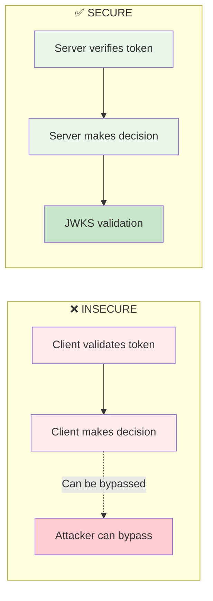
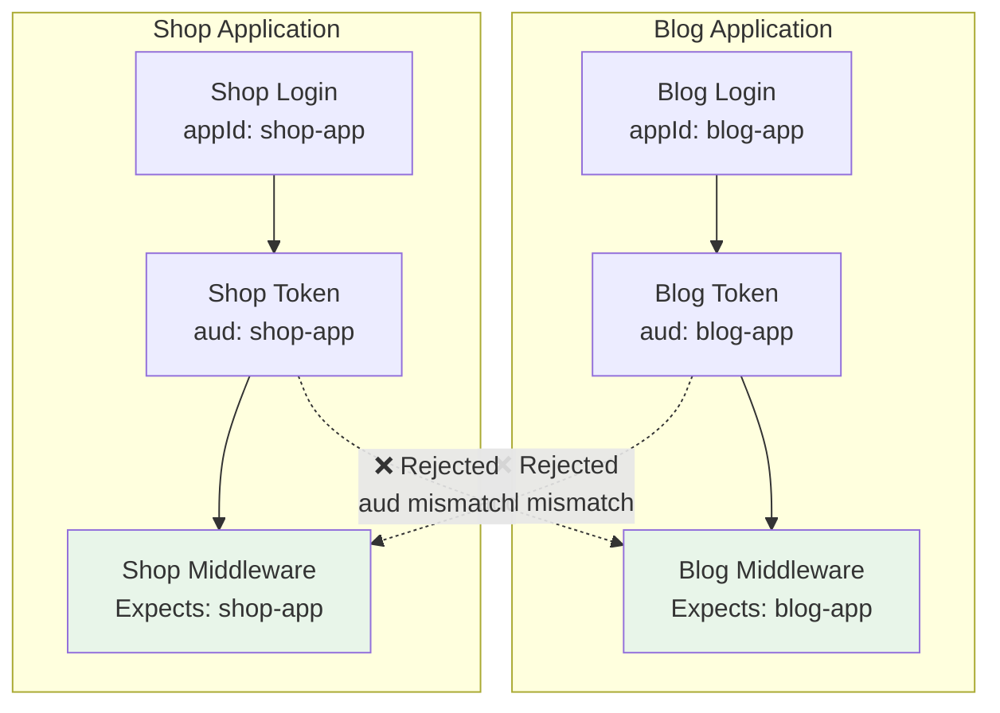

# TurKey SDK Middleware Implementation Guide

## Overview

This guide covers implementing secure JWT authentication middleware across different frameworks, with specific focus on Next.js Edge Runtime constraints and best practices.

## Table of Contents

- [Security Principles](#security-principles)
- [Next.js Middleware (Edge Runtime)](#nextjs-middleware-edge-runtime)
- [Express/Node.js Middleware](#expressnodejs-middleware)
- [Common Pitfalls](#common-pitfalls)
- [Architecture Patterns](#architecture-patterns)

## Security Principles

### The Golden Rule

**🔒 ALWAYS verify JWTs server-side. NEVER trust client-side validation for authorization.**



### Why Server-Side Verification Matters

1. **Client code can be modified** - Attackers can disable client-side checks
2. **JWKS validation is authoritative** - Server fetches current public keys
3. **App ID validation prevents token reuse** - Tokens scoped to specific apps
4. **Signature verification is cryptographic** - ES256 signatures can't be forged

## Next.js Middleware (Edge Runtime)

> 💡 **Recommended:** Use the **[@jimmyjames88/turkey-sdk-next](https://github.com/jimmyjames88/turkey-sdk/tree/master/packages/turkey-sdk-next#readme)** package for zero-configuration Next.js middleware.

### Why a Separate Package?

Next.js middleware runs in the Edge Runtime with strict limitations:

| Feature          | Available | Notes                          |
| ---------------- | --------- | ------------------------------ |
| React components | ❌        | Cannot import client-side code |
| Node.js APIs     | ❌        | No `fs`, `crypto`, etc.        |
| `jose` library   | ✅        | Edge-compatible JWT library    |
| `fetch` API      | ✅        | For JWKS retrieval             |

The `turkey-sdk-next` package is specifically designed for these constraints with sensible defaults.

### Zero-Configuration Setup

```bash
npm install @jimmyjames88/turkey-sdk-next
```

```typescript
// src/middleware.ts
import { createTurKeyMiddleware } from '@jimmyjames88/turkey-sdk-next'

export const middleware = createTurKeyMiddleware({
  baseUrl: process.env.TURKEY_BASE_URL!,
  appId: process.env.TURKEY_APP_ID!,
})

export const config = {
  matcher: ['/((?!_next/static|_next/image|favicon.ico).*)'],
}
```

**Default behavior includes:**

- ✅ Protected routes: `/dashboard`, `/profile`, `/settings`
- ✅ Auth-only routes: `/auth/login`, `/auth/register` (redirects if authenticated)
- ✅ Protected APIs: `/api/protected/*` returns 401 JSON
- ✅ Smart redirects: Unauthenticated → `/auth/login`, Authenticated → `/dashboard`
- ✅ Development logging: Automatic debug mode in development

### Custom Configuration

```typescript
export const middleware = createTurKeyMiddleware({
  baseUrl: process.env.TURKEY_BASE_URL!,
  appId: process.env.TURKEY_APP_ID!,

  // Add more protected routes (merged with defaults)
  routes: {
    protected: ['/admin', '/billing'],
    authOnly: ['/signup'],
    protectedApi: ['/api/admin/*'],
  },

  // Custom redirects
  redirects: {
    unauthenticated: '/signin',
    authenticated: '/home',
  },
})
```

See the [turkey-sdk-next documentation](https://github.com/jimmyjames88/turkey-sdk/tree/master/packages/turkey-sdk-next#readme) for advanced patterns like custom route type detection and role-based access.

### Accessing User Data in Route Handlers

The middleware automatically attaches user information to request headers:

```typescript
// app/api/profile/route.ts
import { headers } from 'next/headers'

export async function GET() {
  const headersList = headers()

  const userId = headersList.get('x-turkey-user-id')
  const userEmail = headersList.get('x-turkey-user-email')
  const userRole = headersList.get('x-turkey-user-role')

  if (!userId) {
    return Response.json({ error: 'Unauthorized' }, { status: 401 })
  }

  return Response.json({ userId, userEmail, userRole })
}
```

## Express/Node.js Middleware

### Direct JWT Verification

```typescript
import express from 'express'
import { verifyJwt } from '@jimmyjames88/turkey-sdk'

const app = express()

app.use(async (req, res, next) => {
  try {
    const authHeader = req.headers.authorization || ''
    if (!authHeader.startsWith('Bearer ')) {
      return res.status(401).json({ error: 'Missing token' })
    }

    const token = authHeader.slice(7)

    // ✅ Secure server-side verification
    const payload = await verifyJwt(token, {
      baseUrl: process.env.TURKEY_BASE_URL!,
      appId: process.env.TURKEY_APP_ID,
    })

    req.user = payload
    next()
  } catch (err) {
    res.status(401).json({ error: 'Invalid token' })
  }
})
```

### Token Extraction Strategies

```typescript
function extractToken(req: express.Request): string | null {
  // 1. Authorization header (recommended for APIs)
  const authHeader = req.headers.authorization
  if (authHeader?.startsWith('Bearer ')) {
    return authHeader.slice(7)
  }

  // 2. Cookie (for browser apps)
  const cookieToken = req.cookies?.turkey_access_token
  if (cookieToken) {
    return cookieToken
  }

  // 3. Custom header (if needed)
  const customHeader = req.headers['x-access-token']
  if (customHeader && typeof customHeader === 'string') {
    return customHeader
  }

  return null
}
```

## Common Pitfalls

### 1. Trusting Client-Side Validation

❌ **WRONG:**

```typescript
// Client side
const payload = await client.validateTokenFormat(token)
if (payload.role === 'admin') {
  // Show admin dashboard
  showAdminDashboard() // Attacker can bypass this!
}
```

✅ **CORRECT:**

```typescript
// Client side - UI decision only
const payload = await client.validateTokenFormat(token)
if (payload.role === 'admin') {
  showAdminButton() // UI hint only
}

// Server side - actual authorization
app.get('/api/admin', async (req, res) => {
  const payload = await verifyJwt(token, config) // Real verification
  if (payload.role !== 'admin') {
    return res.status(403).json({ error: 'Forbidden' })
  }
  // Return admin data
})
```

### 2. Missing Environment Variables

❌ **WRONG:**

```typescript
// Using client-side env vars in middleware
const baseUrl = process.env.NEXT_PUBLIC_TURKEY_BASE_URL // undefined!
```

✅ **CORRECT:**

```typescript
// Use server-side env vars
const baseUrl = process.env.TURKEY_BASE_URL // Works!
```

### 3. Forgetting App ID Validation

Using turkey-sdk-next, app ID validation is automatic:

```typescript
// App ID is required in the config
export const middleware = createTurKeyMiddleware({
  baseUrl: process.env.TURKEY_BASE_URL!,
  appId: process.env.TURKEY_APP_ID!, // Validates aud claim
})
```

This ensures tokens can only be used with their intended application.

## Architecture Patterns

### Multi-App Token Isolation



**Benefits:**

- Token from blog-app cannot access shop-app
- Compromised token has limited blast radius
- Clear security boundaries between applications

### Progressive Enhancement Pattern

Start with no auth, gradually add protection:

```typescript
export function getRouteType(path: string) {
  // Phase 1: Public by default
  if (path.startsWith('/dashboard')) return 'protected'
  return 'public'

  // Phase 2: Add more protected routes
  // if (path.startsWith('/profile')) return 'protected'

  // Phase 3: Add role-based protection
  // if (path.startsWith('/admin')) return 'admin-only'
}
```

## Middleware Enhancements

### CORS Configuration

The middleware supports comprehensive CORS (Cross-Origin Resource Sharing) configuration for handling cross-domain requests.

#### Basic CORS Setup

```typescript
import { createTurkeyMiddleware } from '@jimmyjames88/turkey-sdk/middleware'

const middleware = createTurkeyMiddleware({
  baseUrl: process.env.TURKEY_BASE_URL!,
  appId: process.env.TURKEY_APP_ID,
  cors: true, // Enable CORS with default permissive settings
})

app.use('/api', middleware)
```

#### Custom CORS Configuration

```typescript
const middleware = createTurkeyMiddleware({
  baseUrl: process.env.TURKEY_BASE_URL!,
  appId: process.env.TURKEY_APP_ID,
  cors: {
    origin: 'https://myapp.com', // Allow specific origin
    methods: ['GET', 'POST', 'PUT', 'DELETE'],
    allowedHeaders: ['Content-Type', 'Authorization'],
    exposedHeaders: ['X-RateLimit-Limit', 'X-RateLimit-Remaining'],
    credentials: true, // Allow cookies
    maxAge: 86400, // Preflight cache duration (24 hours)
  },
})
```

#### Dynamic Origin Validation

Allow multiple origins or use a function for complex logic:

```typescript
// Multiple allowed origins
const middleware = createTurkeyMiddleware({
  cors: {
    origin: [
      'https://app.example.com',
      'https://admin.example.com',
      'https://staging.example.com',
    ],
  },
})

// Dynamic validation with function
const middleware = createTurkeyMiddleware({
  cors: {
    origin: (origin) => {
      // Allow all subdomains of example.com
      if (!origin) return true // Allow same-origin requests
      const allowed = /^https:\/\/([a-z0-9-]+\.)?example\.com$/
      return allowed.test(origin)
    },
    credentials: true,
  },
})

// Environment-based CORS
const middleware = createTurkeyMiddleware({
  cors: {
    origin: (origin) => {
      if (process.env.NODE_ENV === 'development') {
        return true // Allow all origins in development
      }
      const allowed = ['https://myapp.com', 'https://www.myapp.com']
      return origin ? allowed.includes(origin) : true
    },
  },
})
```

#### CORS with Rate Limit Headers

The middleware automatically exposes rate limit headers via CORS when available:

```typescript
const middleware = createTurkeyMiddleware({
  cors: true,
  rateLimitHeaders: true, // Exposes X-RateLimit-* headers to clients
})

// Client-side can now access:
// X-RateLimit-Limit
// X-RateLimit-Remaining
// X-RateLimit-Reset
```

#### OPTIONS Preflight Handling

The middleware automatically handles OPTIONS preflight requests:

```typescript
// Preflight requests are handled automatically
// No additional configuration needed

// GET /api/users → Normal request
// OPTIONS /api/users → Preflight (returns 204 with CORS headers)
```

### Request Logging

Configure request logging for debugging and monitoring:

#### Basic Logging

```typescript
const middleware = createTurkeyMiddleware({
  baseUrl: process.env.TURKEY_BASE_URL!,
  appId: process.env.TURKEY_APP_ID,
  logging: true, // Enable logging with default settings
})

// Logs output:
// [TurKey Auth] GET /api/users - Authenticated: user@example.com (user)
```

#### Custom Logging Configuration

```typescript
const middleware = createTurkeyMiddleware({
  logging: {
    enabled: true,
    level: 'info', // 'debug' | 'info' | 'warn' | 'error'
    includeHeaders: true, // Log request headers (sensitive headers redacted)
    includeQuery: true, // Log query parameters
    includeBody: false, // Don't log request body (may contain passwords)
    sensitiveHeaders: ['authorization', 'cookie', 'x-access-token'], // Headers to redact
  },
})
```

#### Custom Logger Integration

Use your own logging library (Winston, Pino, etc.):

```typescript
import winston from 'winston'

const logger = winston.createLogger({
  transports: [new winston.transports.Console()],
})

const middleware = createTurkeyMiddleware({
  logging: {
    enabled: true,
    level: 'info',
    logger: (level, message, meta) => {
      logger.log({
        level,
        message,
        ...meta,
        service: 'turkey-auth',
        timestamp: new Date().toISOString(),
      })
    },
  },
})
```

#### Development vs Production Logging

```typescript
const middleware = createTurkeyMiddleware({
  logging: {
    enabled: true,
    level: process.env.NODE_ENV === 'development' ? 'debug' : 'info',
    includeHeaders: process.env.NODE_ENV === 'development',
    includeBody: process.env.NODE_ENV === 'development',
    // Production: minimal logging
    // Development: verbose logging with headers/body
  },
})
```

#### Sensitive Data Redaction

The middleware automatically redacts sensitive headers:

```typescript
// Default redacted headers:
// - authorization
// - cookie
// - x-access-token

// Customize redaction:
const middleware = createTurkeyMiddleware({
  logging: {
    enabled: true,
    sensitiveHeaders: [
      'authorization',
      'cookie',
      'x-api-key',
      'x-secret-token',
    ],
  },
})

// Log output shows:
// headers: { authorization: '[REDACTED]', 'content-type': 'application/json' }
```

### Production Configuration Example

Complete production-ready middleware setup:

```typescript
import { createTurkeyMiddleware } from '@jimmyjames88/turkey-sdk/middleware'
import pino from 'pino'

const logger = pino({
  level: process.env.LOG_LEVEL || 'info',
  transport: {
    target: 'pino-pretty',
    options: { colorize: true },
  },
})

const middleware = createTurkeyMiddleware({
  baseUrl: process.env.TURKEY_BASE_URL!,
  appId: process.env.TURKEY_APP_ID,

  // CORS: Allow specific origins
  cors: {
    origin: (origin) => {
      const allowed = process.env.ALLOWED_ORIGINS?.split(',') || []
      return origin ? allowed.includes(origin) : true
    },
    credentials: true,
    methods: ['GET', 'POST', 'PUT', 'PATCH', 'DELETE'],
    exposedHeaders: ['X-RateLimit-Limit', 'X-RateLimit-Remaining'],
    maxAge: 86400,
  },

  // Logging: Custom logger with Pino
  logging: {
    enabled: true,
    level: 'info',
    includeQuery: true,
    includeHeaders: false, // Don't log headers in production
    includeBody: false, // Never log bodies (may contain sensitive data)
    logger: (level, message, meta) => {
      logger[level](
        {
          ...meta,
          component: 'turkey-auth',
          environment: process.env.NODE_ENV,
        },
        message
      )
    },
  },

  // Expose rate limit headers
  rateLimitHeaders: true,
})

export default middleware
```

## Testing Middleware

````
### Testing Protected Routes

```bash
# Without token - should redirect/401
curl -i http://localhost:3001/dashboard
# Expected: HTTP 307 Redirect or 401

# With valid token - should succeed
curl -i -H "Cookie: turkey_access_token=eyJhbG..." http://localhost:3001/dashboard
# Expected: HTTP 200 OK with x-turkey-* headers

# With invalid token - should redirect/401
curl -i -H "Cookie: turkey_access_token=invalid" http://localhost:3001/dashboard
# Expected: HTTP 307 Redirect or 401
```

### Verifying User Headers

```bash
curl -i -H "Cookie: turkey_access_token=eyJhbG..." http://localhost:3001/dashboard | grep x-turkey
# Expected output:
# x-turkey-user-id: uuid
# x-turkey-user-email: user@example.com
# x-turkey-user-role: user
# x-turkey-app-id: my-app
```

## Lessons Learned

### Next.js Edge Runtime

1. **Use turkey-sdk-next** - Purpose-built for Edge Runtime constraints
2. **Zero-config by default** - Start simple, customize only when needed
3. **Route detection is automatic** - Sensible defaults for most applications
4. **Smart API handling** - Automatically returns 401 JSON for API routes

### Next.js Specific

1. **Route groups are filesystem-only** - URLs don't include `(groupName)`
2. **Environment variables matter** - Server vs client prefixes
3. **Matcher patterns are critical** - Overly broad matchers slow down app
4. **Dev server restart required** - For environment variable changes

### Security

1. **Always verify server-side** - Client validation is UI-only
2. **App ID validation is crucial** - Prevents cross-app token reuse
3. **JWKS caching is automatic** - jose library handles it
4. **Token extraction order matters** - Cookie first for browser, header for API

## Migration Checklist

Moving from basic auth to TurKey middleware:

- [ ] Set up TurKey server with JWKS endpoint
- [ ] Configure environment variables (`TURKEY_BASE_URL`, `TURKEY_APP_ID`)
- [ ] Implement inline JWT verification in middleware
- [ ] Create route protection configuration
- [ ] Test unauthenticated access (should redirect/401)
- [ ] Test with valid token (should allow access + attach headers)
- [ ] Test with invalid/expired token (should reject)
- [ ] Verify user headers in route handlers
- [ ] Update client-side code to use SDK
- [ ] Remove old authentication logic
- [ ] Document environment variable requirements
- [ ] Update deployment configuration

## Additional Resources

- [TurKey SDK README](./README.md)
- [Next.js Middleware Example](./examples/middleware/next.ts)
- [Express Middleware Example](./examples/middleware/express.ts)
- [Security Best Practices](https://jwt.io/introduction)
````
