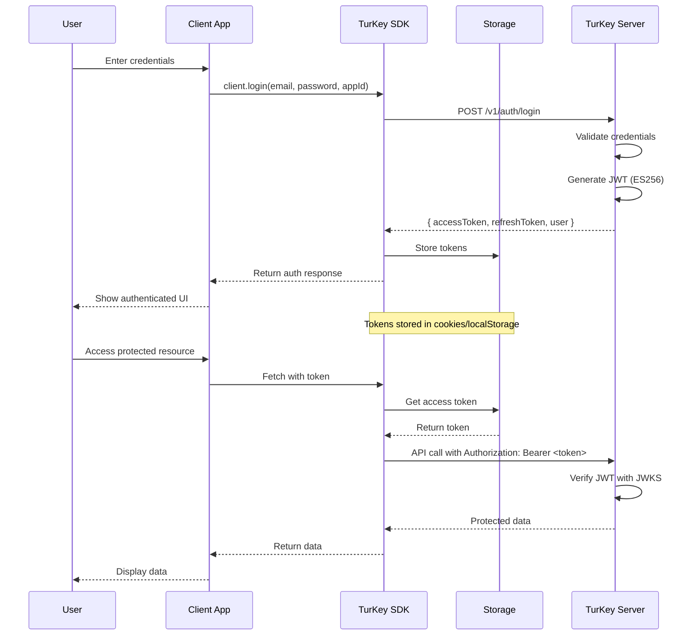
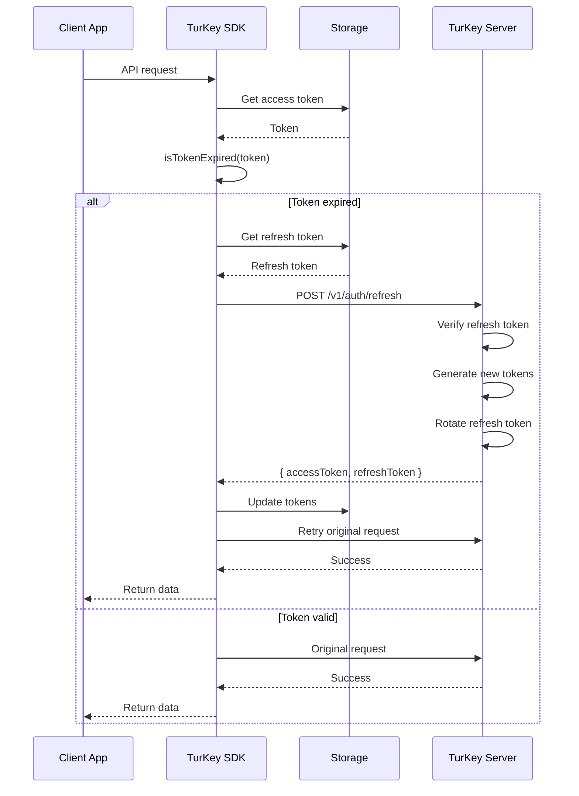
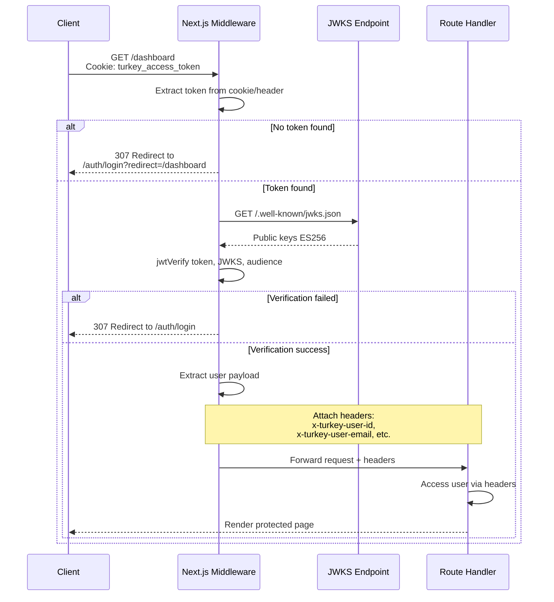
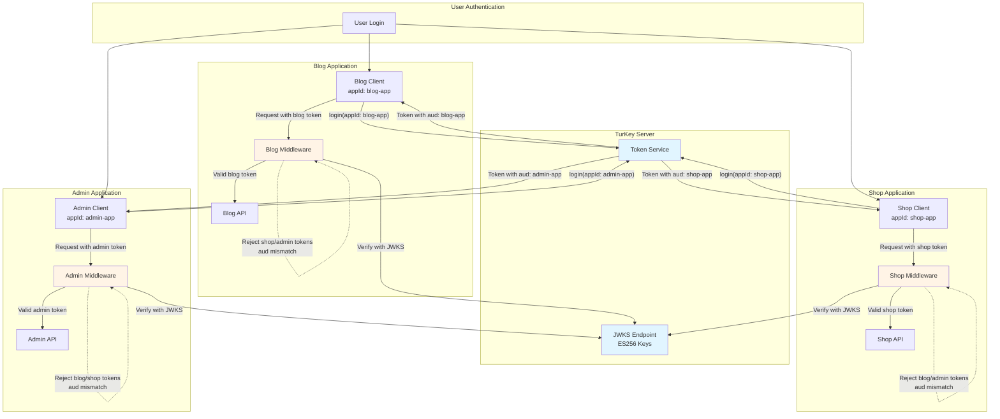
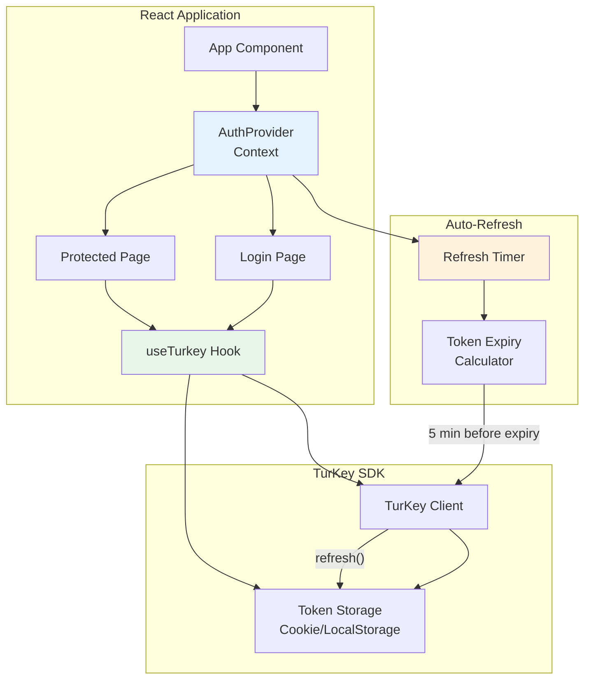
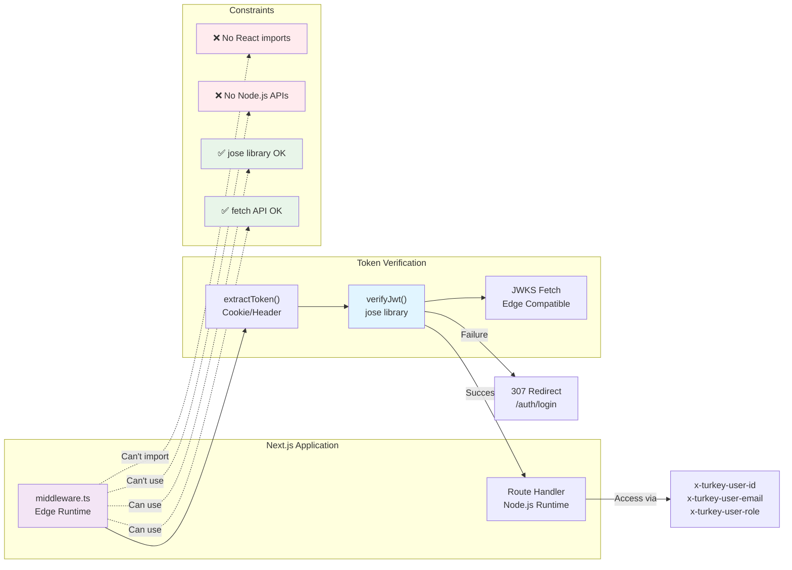
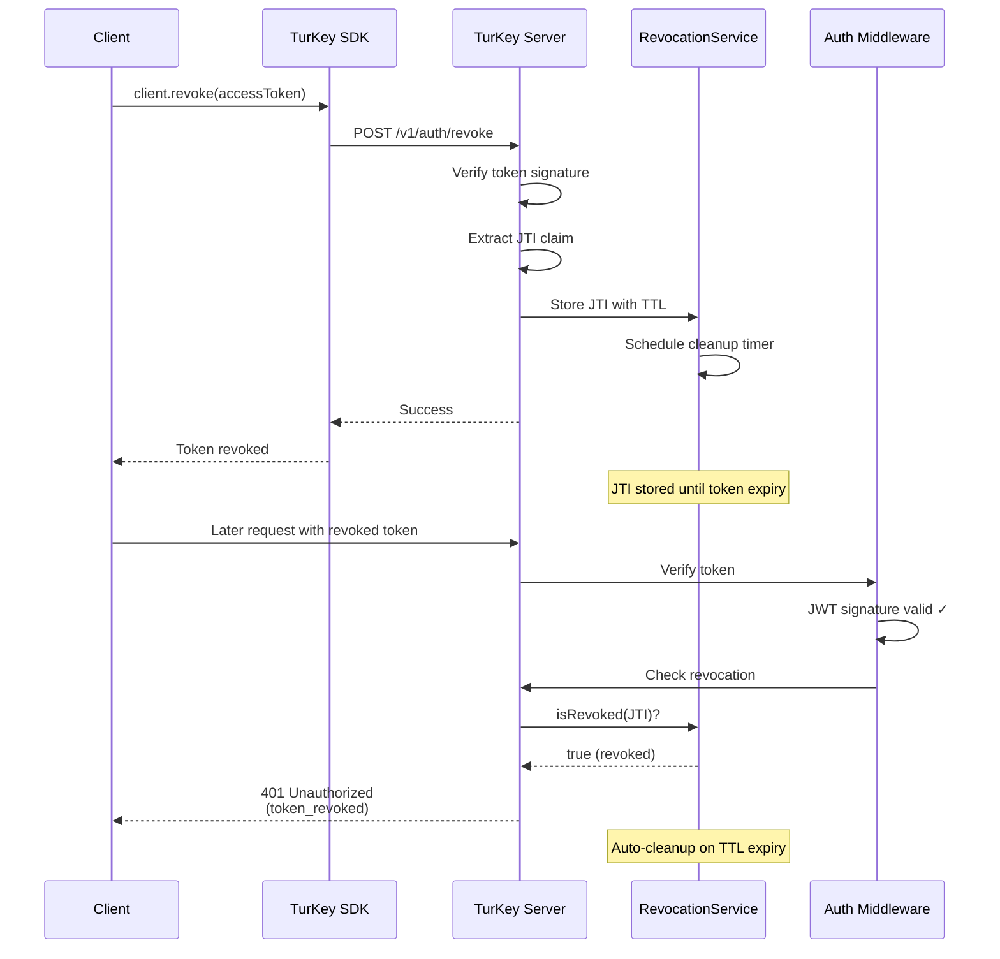
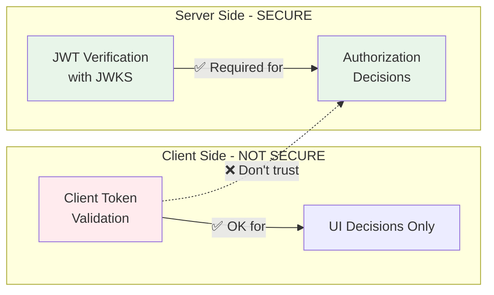

# TurKey SDK

A TypeScript SDK for seamless integration with TurKey JWT authentication service.

## 📚 Documentation

- **[README](./README.md)** - This file: Quick start, API reference, examples
- **[Middleware Guide](./MIDDLEWARE-GUIDE.md)** - Comprehensive middleware implementation guide with security best practices
- **[Examples](./examples/)** - Working code examples for various frameworks

## Features

- 🔐 **Complete Authentication Flow** - Login, register, refresh, logout
- 🎯 **App-Specific Tokens** - Token isolation between applications
- ⚡ **TypeScript First** - Full type safety and IntelliSense
- 🍪 **Flexible Storage** - Cookie, localStorage, or memory storage
- ⚛️ **React Integration** - Ready-to-use hooks and providers
- 🛡️ **JWT Verification** - ES256 signature verification with JWKS
- � **Server Middleware** - Zero-config authentication middleware
- �📦 **Multiple Formats** - ESM and CommonJS builds
- 🧪 **Well Tested** - Comprehensive test suite

## Architecture Overview

The TurKey SDK provides a complete authentication solution spanning client applications, backend services, and the TurKey authentication server.

### Authentication Flow



### Token Refresh Flow



### Server Middleware Verification



### Multi-App Token Architecture



### React Integration Architecture



### Edge Runtime Middleware (Next.js)



## Installation

```bash
npm install @jimmyjames88/turkey-sdk
```

## Quick Start

### Basic Usage

```typescript
import { TurKeyClient, CookieTokenStorage } from '@jimmyjames88/turkey-sdk'

const client = new TurKeyClient({
  baseUrl: 'https://auth.yourapp.com',
  appId: 'my-app',
})

// Login
const { user, accessToken, refreshToken } = await client.login({
  email: 'user@example.com',
  password: 'securepassword',
})

// Store tokens
const storage = new CookieTokenStorage()
storage.setTokens(accessToken, refreshToken)

// Verify tokens
const isValid = await client.verifyToken(accessToken)
const userInfo = client.getUserFromToken(accessToken)
```

### React Integration

```tsx
import { TurKeyClient, AuthProvider, useTurkey } from '@jimmyjames88/turkey-sdk'

function App() {
  const client = new TurKeyClient({
    baseUrl: 'https://auth.yourapp.com',
    appId: 'my-app',
  })

  return (
    <AuthProvider client={client}>
      <LoginComponent />
    </AuthProvider>
  )
}

function LoginComponent() {
  const { login, user, isAuthenticated } = useTurkey()

  if (isAuthenticated) {
    return <div>Welcome, {user?.email}!</div>
  }

  return (
    <button
      onClick={() => login({ email: 'user@example.com', password: 'pass' })}
    >
      Login
    </button>
  )
}
```

### Server Middleware (Zero Configuration)

Protect your API routes with minimal setup using environment-based configuration:

```typescript
// Set environment variables
// TURKEY_BASE_URL=https://your-turkey-server.com
// TURKEY_APP_ID=my-app

import { turkeyAuth } from '@jimmyjames88/turkey-sdk/middleware'
import express from 'express'

const app = express()

// Zero-config authentication - uses environment variables
app.use('/api', turkeyAuth())

// Your protected routes automatically have req.user
app.get('/api/profile', (req, res) => {
  res.json({
    user: req.user, // ✅ Fully typed user object
    message: `Hello ${req.user.email}!`,
  })
})

// Optional authentication for public endpoints
import { optionalAuth } from '@jimmyjames88/turkey-sdk/middleware'
app.use('/api/public', optionalAuth())

app.get('/api/public/stats', (req, res) => {
  if (req.user) {
    res.json({ message: `Personalized stats for ${req.user.email}` })
  } else {
    res.json({ message: 'General stats for anonymous user' })
  }
})
```

#### Framework Compatibility

The core middleware works with **any Node.js framework**:

```typescript
import { createTurkeyMiddleware } from '@jimmyjames88/turkey-sdk/middleware'

// Fastify
const middleware = createTurkeyMiddleware()
fastify.addHook('preHandler', middleware)

// Koa
app.use(async (ctx, next) => {
  await middleware(ctx.request, ctx.response, next)
})

// Hapi, NestJS, etc. - works with any framework
```

## API Reference

### TurKeyClient

The main client for interacting with TurKey authentication service.

#### Constructor

```typescript
new TurKeyClient(config: TurKeyConfig)
```

#### Methods

##### Authentication Methods

###### `login(params: LoginParams): Promise<AuthResponse>`

Authenticate a user with email/password credentials.

**Parameters:**

```typescript
interface LoginParams {
  email: string // User's email address
  password: string // User's password
  appId?: string // Optional app identifier for app-specific tokens
}
```

**Returns:**

```typescript
interface AuthResponse {
  user: {
    id: string
    email: string
    role: string
  }
  accessToken: string // JWT access token
  refreshToken: string // JWT refresh token
  expiresIn: number // Token expiration time in seconds
  tokenType: string // Token type (usually "Bearer")
}
```

**Example:**

```typescript
try {
  const response = await client.login({
    email: 'user@example.com',
    password: 'securepassword',
  })

  console.log('Logged in user:', response.user)
  // Store tokens securely
  storage.setTokens(response.accessToken, response.refreshToken)
} catch (error) {
  console.error('Login failed:', error.message)
}
```

---

###### `register(params: RegisterParams): Promise<AuthResponse>`

Register a new user account.

**Parameters:**

```typescript
interface RegisterParams {
  email: string // User's email address
  password: string // User's password
  role?: 'user' | 'admin' // User role (default: 'user')
  appId?: string // Optional app identifier for app-specific tokens
}
```

**Returns:** Same as `login()` - `AuthResponse`

**Example:**

```typescript
try {
  const response = await client.register({
    email: 'newuser@example.com',
    password: 'securepassword',
    role: 'user',
    appId: 'my-app', // Optional: for app-specific tokens
  })

  console.log('User registered:', response.user)
} catch (error) {
  console.error('Registration failed:', error.message)
}
```

---

###### `refresh(params: RefreshParams): Promise<AuthResponse>`

Refresh an expired access token using a refresh token.

**Parameters:**

```typescript
interface RefreshParams {
  refreshToken: string // Valid refresh token
  appId?: string // Optional appId for app-specific tokens
}
```

**Returns:** `AuthResponse` with new tokens

**Example:**

```typescript
try {
  const response = await client.refresh({
    refreshToken: storage.getRefreshToken(),
  })

  // Update stored tokens
  storage.setTokens(response.accessToken, response.refreshToken)
} catch (error) {
  // Refresh token expired, redirect to login
  console.error('Token refresh failed:', error.message)
  redirectToLogin()
}
```

---

###### `logout(accessToken: string): Promise<void>`

Logout the current session, invalidating the access token.

**Parameters:**

- `accessToken: string` - Current access token to invalidate

**Example:**

```typescript
try {
  await client.logout(storage.getAccessToken())
  storage.clearTokens()
  console.log('Logged out successfully')
} catch (error) {
  console.error('Logout failed:', error.message)
}
```

---

###### `logoutAll(accessToken: string): Promise<void>`

Logout all sessions for the current user, invalidating all tokens.

**Parameters:**

- `accessToken: string` - Current access token

**Example:**

```typescript
try {
  await client.logoutAll(storage.getAccessToken())
  storage.clearTokens()
  console.log('Logged out from all devices')
} catch (error) {
  console.error('Logout all failed:', error.message)
}
```

---

##### Token Revocation Methods

###### `revoke(token: string, reason?: string): Promise<void>`

Revoke a specific access or refresh token immediately.

**Parameters:**

- `token: string` - The access or refresh token to revoke
- `reason?: string` - Optional reason for audit logging

**How it works:**

1. Validates the token signature (proves ownership)
2. Extracts the JTI (JWT ID) claim from the token
3. Stores the JTI in the revocation service with TTL = token expiry
4. All subsequent requests with this token will be rejected by middleware

**Example:**

```typescript
try {
  // Revoke an access token
  await client.revoke(accessToken)
  console.log('Token revoked successfully')

  // Revoke with audit reason
  await client.revoke(accessToken, 'User reported device stolen')

  // Revoke a refresh token
  await client.revoke(refreshToken, 'Password changed')
} catch (error) {
  console.error('Revocation failed:', error.message)
}
```

**Use cases:**

- User logout
- Security incident response
- Password change
- Account deactivation
- Device lost/stolen
- Suspicious activity

---

###### `revokeAll(accessToken: string, refreshToken: string, reason?: string): Promise<void>`

Revoke both access and refresh tokens simultaneously (complete logout).

**Parameters:**

- `accessToken: string` - The access token to revoke
- `refreshToken: string` - The refresh token to revoke
- `reason?: string` - Optional reason for audit logging

**Example:**

```typescript
async function handleLogout() {
  try {
    const accessToken = storage.getAccessToken()
    const refreshToken = storage.getRefreshToken()

    // Revoke both tokens at once
    await client.revokeAll(accessToken, refreshToken, 'User logout')

    // Clear local storage
    storage.clearTokens()

    // Redirect to login
    router.push('/auth/login')
  } catch (error) {
    console.error('Logout failed:', error.message)
    // Clear storage anyway for UX
    storage.clearTokens()
  }
}
```

**Use cases:**

- User logout (recommended over `logout()`)
- Account termination
- Security incident - revoke all sessions
- Password reset completion

---

##### Profile Management Methods

###### `getCurrentUser(accessToken: string): Promise<User>`

Get current user's profile information.

**Parameters:**

- `accessToken: string` - Valid access token

**Returns:**

```typescript
interface User {
  id: string
  email: string
  role: string
}
```

**Example:**

```typescript
try {
  const user = await client.getCurrentUser(accessToken)
  console.log('User profile:', user)
} catch (error) {
  console.error('Failed to fetch user:', error)
}
```

---

###### `updateProfile(accessToken: string, updates: UpdateProfileRequest): Promise<UpdateProfileResponse>`

Update current user's profile (email only for now).

**Parameters:**

```typescript
interface UpdateProfileRequest {
  email?: string // New email address
}
```

**Returns:**

```typescript
interface UpdateProfileResponse {
  message: string
  user: User // Updated user object
}
```

**Example:**

```typescript
try {
  const result = await client.updateProfile(accessToken, {
    email: 'newemail@example.com',
  })

  console.log(result.message) // "Profile updated successfully"
  console.log('Updated user:', result.user)
} catch (error) {
  if (error instanceof ValidationError) {
    console.error('Validation failed:', error.details)
  } else if (error instanceof AuthenticationError) {
    console.error('Token expired or invalid')
  }
}
```

---

###### `changePassword(accessToken: string, params: ChangePasswordRequest): Promise<ChangePasswordResponse>`

Change current user's password.

⚠️ **Important:** This will revoke all refresh tokens, requiring re-authentication on all devices.

**Parameters:**

```typescript
interface ChangePasswordRequest {
  currentPassword: string // Current password for verification
  newPassword: string // New password (must pass strength validation)
}
```

**Returns:**

```typescript
interface ChangePasswordResponse {
  message: string
  requiresReauthentication: boolean // Always true after password change
}
```

**Example:**

```typescript
try {
  const result = await client.changePassword(accessToken, {
    currentPassword: 'OldPassword123!',
    newPassword: 'NewSecurePassword456!',
  })

  console.log(result.message)

  if (result.requiresReauthentication) {
    // All refresh tokens are revoked, redirect to login
    storage.clearTokens()
    router.push('/auth/login')
  }
} catch (error) {
  if (error instanceof ValidationError) {
    // Display field-specific errors (weak password, same password, etc.)
    error.details?.forEach((detail) => {
      console.error(`${detail.field}: ${detail.message}`)
    })
  } else if (error instanceof AuthenticationError) {
    console.error('Current password is incorrect')
  }
}
```

**Client-side validation:**

- Validates current password is provided
- Validates new password is provided
- Prevents using the same password
- Validates new password strength automatically

---

###### `deleteAccount(accessToken: string): Promise<DeleteAccountResponse>`

Delete current user's account permanently.

⚠️ **Warning:** This action is irreversible. All user data will be deleted.

**Returns:**

```typescript
interface DeleteAccountResponse {
  message: string
  deletedUser: {
    id: string
    email: string
  }
}
```

**Example:**

```typescript
try {
  // Show confirmation dialog first
  if (
    !confirm(
      'Are you sure you want to delete your account? This action cannot be undone.'
    )
  ) {
    return
  }

  const result = await client.deleteAccount(accessToken)

  console.log(result.message)
  console.log('Deleted account:', result.deletedUser)

  // Clear tokens and redirect
  storage.clearTokens()
  router.push('/')
} catch (error) {
  console.error('Failed to delete account:', error)
}
```

For comprehensive profile management examples, see [`examples/profile-management.ts`](./examples/profile-management.ts).

---

##### Token Verification Methods

###### `validateTokenFormat(token: string, appId?: string): Promise<JWTPayload>`

Client-side token format validation for UI purposes only.

⚠️ **WARNING: This is NOT secure for authorization decisions!**
⚠️ **Always use server-side `verifyJwt()` for auth/authz.**

**Use cases:**

- Validating token format before sending to server
- Client-side error handling and user feedback
- Development/debugging token issues

**Parameters:**

- `token: string` - JWT token to validate
- `appId?: string` - Optional app ID to verify (defaults to client's appId)

**Returns:**

```typescript
interface JWTPayload {
  sub: string // Subject (user ID)
  email: string // User email
  role: string // User role
  scope?: string // Token scope
  aud: string // App ID
  iss: string // Issuer
  exp: number // Expiration timestamp
  iat: number // Issued at timestamp
}
```

**Example:**

```typescript
try {
  // ✅ Good: Format validation for UX
  const payload = await client.validateTokenFormat(accessToken)
  console.log('Token format is valid, user:', payload.email)

  // ❌ Bad: Don't use for security decisions!
  // if (payload.role === 'admin') { return adminData } // Insecure!
} catch (error) {
  console.error('Token format validation failed:', error.message)
  showLoginForm() // UX decision only
}
```

---

###### `verifyToken(token: string, appId?: string): Promise<JWTPayload>` ⚠️ **DEPRECATED**

**This method is deprecated and will be removed in v1.0.0. Use `validateTokenFormat()` instead.**

This method name is misleading as it suggests security when it's only format validation.

---

###### `decodeToken(token: string): JWTPayload`

Decode a JWT token without verifying its signature (use with caution).

**Parameters:**

- `token: string` - JWT token to decode

**Returns:** `JWTPayload` (unverified)

**Example:**

```typescript
try {
  const payload = client.decodeToken(accessToken)
  console.log('Token claims:', payload)
  // Note: This does NOT verify the token signature
} catch (error) {
  console.error('Token decode failed:', error.message)
}
```

---

###### `getUserFromToken(token: string): User`

Extract user information from a JWT token without verification.

**Parameters:**

- `token: string` - JWT token

**Returns:**

```typescript
interface User {
  id: string
  email: string
  role: string
}
```

**Example:**

```typescript
try {
  const user = client.getUserFromToken(accessToken)
  console.log('Current user:', user)
} catch (error) {
  console.error('Failed to extract user:', error.message)
}
```

---

###### `isTokenExpired(token: string): boolean`

Check if a JWT token is expired based on its `exp` claim.

**Parameters:**

- `token: string` - JWT token to check

**Returns:** `boolean` - `true` if expired, `false` if valid

**Example:**

```typescript
const accessToken = storage.getAccessToken()

if (client.isTokenExpired(accessToken)) {
  console.log('Token expired, refreshing...')
  await client.refresh({ refreshToken: storage.getRefreshToken() })
} else {
  console.log('Token is still valid')
}
```

---

###### `getTimeUntilExpiry(token: string): number`

Get the number of seconds until a token expires.

**Parameters:**

- `token: string` - JWT token

**Returns:** `number` - Seconds until expiration (negative if already expired)

**Example:**

```typescript
const accessToken = storage.getAccessToken()
const secondsLeft = client.getTimeUntilExpiry(accessToken)

if (secondsLeft > 0) {
  console.log(`Token expires in ${secondsLeft} seconds`)

  if (secondsLeft < 300) {
    // Less than 5 minutes
    console.log('Token expiring soon, consider refreshing')
  }
} else {
  console.log('Token has already expired')
}
```

---

###### `introspect(token: string): Promise<IntrospectionResult>`

Introspect a token via the TurKey server to check its validity and retrieve metadata.

**Parameters:**

- `token: string` - Access or refresh token to introspect

**Returns:**

```typescript
interface IntrospectionResult {
  active: boolean // Whether the token is valid and active
  type?: 'access' | 'refresh' // Token type
  payload?: JWTPayload // Decoded JWT payload (for access tokens)
  expiresAt?: string // Expiration timestamp (for refresh tokens)
  userId?: string // User ID (for refresh tokens)
}
```

**Example:**

```typescript
try {
  const result = await client.introspect(accessToken)

  if (result.active) {
    console.log('Token is valid')
    if (result.type === 'access' && result.payload) {
      console.log('User:', result.payload.email)
      console.log('Role:', result.payload.role)
    }
  } else {
    console.log('Token is invalid or expired')
  }
} catch (error) {
  console.error('Introspection failed:', error.message)
}
```

---

##### Email & Password Reset Methods

###### `requestPasswordReset(email: string): Promise<RequestPasswordResetResponse>`

Request a password reset email for a user.

**Parameters:**

- `email: string` - User's email address

**Returns:**

```typescript
interface RequestPasswordResetResponse {
  message: string // Always returns success for security (prevents email enumeration)
}
```

**Security Features:**

- Email enumeration prevention (always returns success)
- Rate limited on the server (3 per hour per user)
- Tokens expire after 1 hour by default

**Example:**

```typescript
try {
  const response = await client.requestPasswordReset('user@example.com')
  console.log(response.message)
  // Show success message to user
  alert('If your email exists, you will receive a password reset link')
} catch (error) {
  console.error('Password reset request failed:', error.message)
}
```

---

###### `resetPassword(token: string, newPassword: string): Promise<ResetPasswordResponse>`

Complete the password reset using the token from the email.

**Parameters:**

- `token: string` - Reset token from email
- `newPassword: string` - New password (must meet strength requirements)

**Returns:**

```typescript
interface ResetPasswordResponse {
  message: string // Success message
}
```

**Password Requirements:**

- Minimum 8 characters
- At least one uppercase letter
- At least one lowercase letter
- At least one number
- At least one special character (@$!%\*?&)

**Example:**

```typescript
try {
  // Extract token from URL query parameter
  const urlParams = new URLSearchParams(window.location.search)
  const token = urlParams.get('token')

  if (token) {
    const response = await client.resetPassword(token, 'NewSecure123!')
    console.log(response.message)
    // Redirect to login
    window.location.href = '/login?reset=success'
  }
} catch (error) {
  if (error.code === 'invalid_token') {
    alert('Invalid or expired reset link')
  } else if (error.code === 'weak_password') {
    alert('Password does not meet security requirements')
  } else {
    console.error('Password reset failed:', error.message)
  }
}
```

---

###### `verifyEmail(token: string): Promise<VerifyEmailResponse>`

Verify a user's email address using the token from the verification email.

**Parameters:**

- `token: string` - Verification token from email

**Returns:**

```typescript
interface VerifyEmailResponse {
  message: string // Success message
  user: {
    id: string
    email: string
    emailVerified: boolean // Will be true after successful verification
  }
}
```

**Example:**

```typescript
try {
  // Extract token from URL query parameter
  const urlParams = new URLSearchParams(window.location.search)
  const token = urlParams.get('token')

  if (token) {
    const response = await client.verifyEmail(token)
    console.log(response.message)
    console.log('User verified:', response.user)
    // Show success message and redirect
    alert('Email verified successfully! Welcome!')
    window.location.href = '/dashboard'
  }
} catch (error) {
  if (error.code === 'invalid_token') {
    alert('Invalid or expired verification link')
  } else {
    console.error('Email verification failed:', error.message)
  }
}
```

---

###### `resendVerification(email: string): Promise<ResendVerificationResponse>`

Resend the email verification link to a user.

**Parameters:**

- `email: string` - User's email address

**Returns:**

```typescript
interface ResendVerificationResponse {
  message: string // Always returns success for security (prevents email enumeration)
}
```

**Security Features:**

- Email enumeration prevention (always returns success)
- Rate limited on the server (5 per 15 min via login rate limit)
- Maximum 3 verification emails per hour per user
- No-op if email already verified

**Example:**

```typescript
try {
  const response = await client.resendVerification('user@example.com')
  console.log(response.message)
  alert('If your email is not verified, a new verification link has been sent')
} catch (error) {
  console.error('Resend verification failed:', error.message)
}
```

---

### Storage Options

#### CookieTokenStorage (Recommended)

```typescript
const storage = new CookieTokenStorage({
  secure: true,
  sameSite: 'strict',
  domain: '.yourapp.com',
})
```

#### LocalStorageTokenStorage

```typescript
const storage = new LocalStorageTokenStorage()
```

#### MemoryTokenStorage

```typescript
const storage = new MemoryTokenStorage()
```

### React Hooks

#### useTurkey()

Primary hook for authentication state and actions.

```typescript
const {
  user, // Current user info
  isAuthenticated, // Authentication status
  isLoading, // Loading state
  login, // Login function
  register, // Register function
  logout, // Logout function
  refreshTokens, // Manual refresh
  client, // TurKey client instance
} = useTurkey()
```

#### useAccessToken()

Get current access token from storage.

```typescript
const accessToken = useAccessToken(storage)
```

#### useAuthenticatedFetch()

Fetch wrapper that automatically includes auth headers.

```typescript
const authenticatedFetch = useAuthenticatedFetch(storage)
const response = await authenticatedFetch('/api/protected-endpoint')
```

---

## Email Integration Examples

### Password Reset Flow

Complete implementation of password reset with error handling:

```typescript
// 1. Password Reset Request Page
import { useState } from 'react'
import { TurKeyClient } from '@jimmyjames88/turkey-sdk'

function ForgotPasswordPage() {
  const [email, setEmail] = useState('')
  const [status, setStatus] = useState<'idle' | 'loading' | 'success' | 'error'>('idle')
  const client = new TurKeyClient({ baseUrl: 'https://auth.yourapp.com' })

  const handleSubmit = async (e: React.FormEvent) => {
    e.preventDefault()
    setStatus('loading')

    try {
      await client.requestPasswordReset(email)
      setStatus('success')
    } catch (error) {
      console.error(error)
      setStatus('error')
    }
  }

  return (
    <div>
      <h1>Forgot Password</h1>
      {status === 'success' ? (
        <p>If an account exists with that email, you will receive a password reset link.</p>
      ) : (
        <form onSubmit={handleSubmit}>
          <input
            type="email"
            value={email}
            onChange={(e) => setEmail(e.target.value)}
            placeholder="Enter your email"
            required
          />
          <button type="submit" disabled={status === 'loading'}>
            {status === 'loading' ? 'Sending...' : 'Send Reset Link'}
          </button>
          {status === 'error' && <p>Something went wrong. Please try again.</p>}
        </form>
      )}
    </div>
  )
}

// 2. Password Reset Completion Page
import { useState, useEffect } from 'react'
import { useSearchParams, useNavigate } from 'react-router-dom'

function ResetPasswordPage() {
  const [searchParams] = useSearchParams()
  const navigate = useNavigate()
  const [password, setPassword] = useState('')
  const [confirmPassword, setConfirmPassword] = useState('')
  const [status, setStatus] = useState<'idle' | 'loading' | 'success' | 'error'>('idle')
  const [error, setError] = useState('')
  const client = new TurKeyClient({ baseUrl: 'https://auth.yourapp.com' })

  const token = searchParams.get('token')

  useEffect(() => {
    if (!token) {
      navigate('/forgot-password')
    }
  }, [token, navigate])

  const validatePassword = (pwd: string): string | null => {
    if (pwd.length < 8) return 'Password must be at least 8 characters'
    if (!/[A-Z]/.test(pwd)) return 'Password must contain an uppercase letter'
    if (!/[a-z]/.test(pwd)) return 'Password must contain a lowercase letter'
    if (!/\d/.test(pwd)) return 'Password must contain a number'
    if (!/[@$!%*?&]/.test(pwd)) return 'Password must contain a special character'
    return null
  }

  const handleSubmit = async (e: React.FormEvent) => {
    e.preventDefault()
    setError('')

    // Validation
    if (password !== confirmPassword) {
      setError('Passwords do not match')
      return
    }

    const validationError = validatePassword(password)
    if (validationError) {
      setError(validationError)
      return
    }

    setStatus('loading')

    try {
      await client.resetPassword(token!, password)
      setStatus('success')
      setTimeout(() => navigate('/login?reset=success'), 2000)
    } catch (error: any) {
      setStatus('error')
      if (error.code === 'invalid_token') {
        setError('Invalid or expired reset link. Please request a new one.')
      } else if (error.code === 'weak_password') {
        setError('Password does not meet security requirements')
      } else {
        setError('Failed to reset password. Please try again.')
      }
    }
  }

  return (
    <div>
      <h1>Reset Password</h1>
      {status === 'success' ? (
        <p>Password reset successfully! Redirecting to login...</p>
      ) : (
        <form onSubmit={handleSubmit}>
          <input
            type="password"
            value={password}
            onChange={(e) => setPassword(e.target.value)}
            placeholder="New password"
            required
          />
          <input
            type="password"
            value={confirmPassword}
            onChange={(e) => setConfirmPassword(e.target.value)}
            placeholder="Confirm password"
            required
          />
          <button type="submit" disabled={status === 'loading'}>
            {status === 'loading' ? 'Resetting...' : 'Reset Password'}
          </button>
          {error && <p style={{ color: 'red' }}>{error}</p>}
        </form>
      )}
    </div>
  )
}
```

### Email Verification Flow

Complete email verification with automatic handling:

```typescript
// 1. Email Verification Handler (runs on load)
import { useEffect, useState } from 'react'
import { useSearchParams, useNavigate } from 'react-router-dom'
import { TurKeyClient } from '@jimmyjames88/turkey-sdk'

function EmailVerificationPage() {
  const [searchParams] = useSearchParams()
  const navigate = useNavigate()
  const [status, setStatus] = useState<'verifying' | 'success' | 'error'>('verifying')
  const [error, setError] = useState('')
  const client = new TurKeyClient({ baseUrl: 'https://auth.yourapp.com' })

  useEffect(() => {
    const token = searchParams.get('token')

    if (!token) {
      setStatus('error')
      setError('No verification token provided')
      return
    }

    const verify = async () => {
      try {
        const response = await client.verifyEmail(token)
        console.log('Verified user:', response.user)
        setStatus('success')
        // Redirect to dashboard after 2 seconds
        setTimeout(() => navigate('/dashboard'), 2000)
      } catch (error: any) {
        setStatus('error')
        if (error.code === 'invalid_token') {
          setError('Invalid or expired verification link')
        } else {
          setError('Verification failed. Please try again.')
        }
      }
    }

    verify()
  }, [searchParams, navigate])

  return (
    <div>
      <h1>Email Verification</h1>
      {status === 'verifying' && <p>Verifying your email...</p>}
      {status === 'success' && (
        <div>
          <p>✅ Email verified successfully!</p>
          <p>Redirecting to dashboard...</p>
        </div>
      )}
      {status === 'error' && (
        <div>
          <p>❌ {error}</p>
          <button onClick={() => navigate('/resend-verification')}>
            Request New Link
          </button>
        </div>
      )}
    </div>
  )
}

// 2. Resend Verification Page
function ResendVerificationPage() {
  const [email, setEmail] = useState('')
  const [status, setStatus] = useState<'idle' | 'loading' | 'success'>('idle')
  const client = new TurKeyClient({ baseUrl: 'https://auth.yourapp.com' })

  const handleSubmit = async (e: React.FormEvent) => {
    e.preventDefault()
    setStatus('loading')

    try {
      await client.resendVerification(email)
      setStatus('success')
    } catch (error) {
      console.error(error)
      setStatus('success') // Always show success (email enumeration prevention)
    }
  }

  return (
    <div>
      <h1>Resend Verification Email</h1>
      {status === 'success' ? (
        <p>If your email is not verified, a new verification link has been sent.</p>
      ) : (
        <form onSubmit={handleSubmit}>
          <input
            type="email"
            value={email}
            onChange={(e) => setEmail(e.target.value)}
            placeholder="Enter your email"
            required
          />
          <button type="submit" disabled={status === 'loading'}>
            {status === 'loading' ? 'Sending...' : 'Resend Link'}
          </button>
        </form>
      )}
    </div>
  )
}

// 3. Registration with Email Verification
function RegisterPage() {
  const [email, setEmail] = useState('')
  const [password, setPassword] = useState('')
  const [status, setStatus] = useState<'idle' | 'loading' | 'success' | 'error'>('idle')
  const client = new TurKeyClient({ baseUrl: 'https://auth.yourapp.com' })

  const handleSubmit = async (e: React.FormEvent) => {
    e.preventDefault()
    setStatus('loading')

    try {
      // Registration automatically sends verification email
      await client.register({ email, password })
      setStatus('success')
    } catch (error) {
      console.error(error)
      setStatus('error')
    }
  }

  return (
    <div>
      <h1>Register</h1>
      {status === 'success' ? (
        <div>
          <p>✅ Account created successfully!</p>
          <p>📧 Please check your email to verify your account.</p>
        </div>
      ) : (
        <form onSubmit={handleSubmit}>
          <input
            type="email"
            value={email}
            onChange={(e) => setEmail(e.target.value)}
            placeholder="Email"
            required
          />
          <input
            type="password"
            value={password}
            onChange={(e) => setPassword(e.target.value)}
            placeholder="Password"
            required
          />
          <button type="submit" disabled={status === 'loading'}>
            {status === 'loading' ? 'Creating Account...' : 'Register'}
          </button>
          {status === 'error' && <p>Registration failed. Please try again.</p>}
        </form>
      )}
    </div>
  )
}
```

### Email Verification with React Context

Integrate email verification into your auth flow:

```typescript
import { useEffect } from 'react'
import { useTurkey } from '@jimmyjames88/turkey-sdk'

function ProtectedRoute({ children }: { children: React.ReactNode }) {
  const { user, client } = useTurkey()

  if (!user) {
    return <Navigate to="/login" />
  }

  // Check if email verification is required
  if (user.emailVerified === false) {
    return (
      <div>
        <h2>Email Verification Required</h2>
        <p>Please verify your email to access this page.</p>
        <button
          onClick={() => client.resendVerification(user.email)}
        >
          Resend Verification Email
        </button>
      </div>
    )
  }

  return <>{children}</>
}
```

---

## Token Revocation

TurKey SDK provides comprehensive token revocation capabilities for enhanced security. When a token is compromised, a user logs out, or account access needs to be terminated, revocation ensures tokens are immediately invalidated.

### Revocation Architecture



### Basic Usage

#### Revoking Individual Tokens

```typescript
import { TurKeyClient } from '@jimmyjames88/turkey-sdk'

const client = new TurKeyClient({
  baseUrl: 'https://auth.yourapp.com',
  appId: 'my-app',
})

// Revoke an access token
try {
  await client.revoke(accessToken)
  console.log('Token revoked successfully')
} catch (error) {
  console.error('Revocation failed:', error.message)
}

// Revoke with a reason (for audit logs)
await client.revoke(accessToken, 'User reported suspicious activity')

// Revoke a refresh token
await client.revoke(refreshToken)
```

#### Revoking All Tokens (Complete Logout)

```typescript
// Revoke both access and refresh tokens simultaneously
await client.revokeAll(accessToken, refreshToken)

// With audit reason
await client.revokeAll(
  accessToken,
  refreshToken,
  'Account compromised - security incident'
)

// Clear local storage after revocation
storage.clearTokens()
```

### Common Revocation Scenarios

#### 1. User Logout

```typescript
async function handleLogout() {
  try {
    const accessToken = storage.getAccessToken()
    const refreshToken = storage.getRefreshToken()

    // Revoke both tokens on logout
    await client.revokeAll(accessToken, refreshToken, 'User logout')

    // Clear local storage
    storage.clearTokens()

    // Redirect to login page
    router.push('/auth/login')
  } catch (error) {
    console.error('Logout failed:', error.message)
    // Clear storage anyway for UX
    storage.clearTokens()
  }
}
```

#### 2. Security Incident Response

```typescript
async function handleSecurityIncident(compromisedToken: string) {
  try {
    // Immediately revoke the compromised token
    await client.revoke(
      compromisedToken,
      'Security incident - suspicious activity detected'
    )

    // Force user to re-authenticate
    storage.clearTokens()
    showSecurityAlert('Your session has been terminated for security reasons')
    router.push('/auth/login')
  } catch (error) {
    console.error('Emergency revocation failed:', error.message)
  }
}
```

#### 3. Account Deactivation

```typescript
async function deactivateAccount(userId: string) {
  try {
    // Admin action: revoke all active sessions for a user
    // This requires a server-side endpoint that:
    // 1. Fetches all active tokens for the user
    // 2. Revokes each token

    await adminClient.revokeAllUserTokens(userId, 'Account deactivation')

    console.log(`All sessions revoked for user ${userId}`)
  } catch (error) {
    console.error('Account deactivation failed:', error.message)
  }
}
```

#### 4. Token Rotation with Revocation

```typescript
async function rotateTokenWithRevocation() {
  try {
    const oldAccessToken = storage.getAccessToken()
    const refreshToken = storage.getRefreshToken()

    // Get new tokens
    const { accessToken: newAccessToken, refreshToken: newRefreshToken } =
      await client.refresh({ refreshToken })

    // Store new tokens
    storage.setTokens(newAccessToken, newRefreshToken)

    // Revoke old access token (refresh token is auto-rotated)
    await client.revoke(oldAccessToken, 'Token rotation')

    console.log('Tokens rotated and old token revoked')
  } catch (error) {
    console.error('Token rotation failed:', error.message)
  }
}
```

### Server-Side Revocation Checking

The SDK automatically checks revocation when using middleware, but you can also manually check revocation status:

#### Using Middleware (Automatic)

```typescript
import { createTurkeyMiddleware } from '@jimmyjames88/turkey-sdk/middleware'

const middleware = createTurkeyMiddleware({
  baseUrl: process.env.TURKEY_BASE_URL!,
  appId: process.env.TURKEY_APP_ID,
  checkRevocation: true, // Default: true - automatically checks revocation
})

app.use('/api/protected', middleware)

// Revoked tokens are automatically rejected with 401
```

#### Manual Revocation Check

```typescript
import { checkRevocation } from '@jimmyjames88/turkey-sdk/server'

app.get('/api/custom-check', async (req, res) => {
  try {
    const token = req.headers.authorization?.slice(7) // Remove "Bearer "
    const payload = client.decodeToken(token!)

    // Check if this specific JTI has been revoked
    const isRevoked = await checkRevocation(payload.jti, {
      baseUrl: process.env.TURKEY_BASE_URL!,
    })

    if (isRevoked) {
      return res.status(401).json({
        error: 'token_revoked',
        message: 'This token has been revoked',
      })
    }

    // Token is valid and not revoked
    res.json({ valid: true })
  } catch (error) {
    res.status(500).json({ error: 'Revocation check failed' })
  }
})
```

#### Get Revocation Details

```typescript
import { getRevocationInfo } from '@jimmyjames88/turkey-sdk/server'

app.get('/api/revocation-info', async (req, res) => {
  try {
    const token = req.headers.authorization?.slice(7)
    const payload = client.decodeToken(token!)

    const info = await getRevocationInfo(payload.jti, {
      baseUrl: process.env.TURKEY_BASE_URL!,
    })

    if (info) {
      res.json({
        revoked: info.revoked,
        revokedAt: new Date(info.revokedAt).toISOString(),
        reason: info.reason || 'No reason provided',
      })
    } else {
      res.json({ revoked: false })
    }
  } catch (error) {
    res.status(500).json({ error: 'Failed to get revocation info' })
  }
})
```

### Revocation Security Model

#### Fail-Open Strategy

The SDK uses a **fail-open** strategy for revocation checks to prevent service disruptions:

```typescript
// If revocation check fails (network error, server down, etc.),
// the token is ALLOWED, not rejected

// This prevents:
// ✅ Service outages from blocking all authenticated requests
// ✅ Network issues from causing cascading failures
// ✅ SPOF (Single Point of Failure) from revocation service

// Trade-off:
// ⚠️ Revoked tokens might work briefly during outages
// ✅ But normal security is maintained when service is healthy
```

**Configure fail-open behavior:**

```typescript
const middleware = createTurkeyMiddleware({
  baseUrl: process.env.TURKEY_BASE_URL!,
  appId: process.env.TURKEY_APP_ID,
  checkRevocation: true, // Can be disabled in development
})

// For development environments, you might disable revocation checks:
const devMiddleware = createTurkeyMiddleware({
  baseUrl: process.env.TURKEY_BASE_URL!,
  checkRevocation: process.env.NODE_ENV === 'production',
})
```

#### JTI-Based Revocation

TurKey uses **JTI (JWT ID)** claims for revocation:

- ✅ Each token has a unique `jti` claim
- ✅ Revocation is instant - no token grace period
- ✅ Revoked JTIs are stored until token expiry (TTL-based cleanup)
- ✅ Memory-efficient - only stores revoked tokens, not all tokens
- ✅ Automatic cleanup - expired revocations are auto-removed

**JTI Example:**

```typescript
const payload = client.decodeToken(accessToken)
console.log(payload.jti) // "a8f9b2c4-3d1e-4f7a-9b8c-1d2e3f4a5b6c"

// When revoked, this JTI is stored in the revocation service
// All middleware checks validate against the revocation list
```

#### Cross-App Revocation

Revocation works across all apps in your ecosystem:

```typescript
// User logs in to Blog app
const blogClient = new TurKeyClient({
  baseUrl: 'https://auth.yourapp.com',
  appId: 'blog-app',
})
const { accessToken: blogToken } = await blogClient.login(credentials)

// User logs in to Shop app
const shopClient = new TurKeyClient({
  baseUrl: 'https://auth.yourapp.com',
  appId: 'shop-app',
})
const { accessToken: shopToken } = await shopClient.login(credentials)

// Revoking the blog token doesn't affect shop token
await blogClient.revoke(blogToken)
// Blog token is revoked ❌
// Shop token still works ✅

// But you can revoke all tokens for a user via logoutAll
await blogClient.logoutAll(blogToken)
// This increments the user's token version
// Both blog AND shop tokens become invalid ❌
```

### Revocation Best Practices

#### 1. Always Revoke on Logout

```typescript
// ❌ Bad: Just clearing local storage
function badLogout() {
  storage.clearTokens()
  router.push('/login')
}

// ✅ Good: Revoke tokens before clearing storage
async function goodLogout() {
  const accessToken = storage.getAccessToken()
  const refreshToken = storage.getRefreshToken()

  try {
    await client.revokeAll(accessToken, refreshToken, 'User logout')
  } catch (error) {
    console.error('Revocation failed:', error.message)
  } finally {
    // Clear storage even if revocation fails
    storage.clearTokens()
    router.push('/login')
  }
}
```

#### 2. Provide Audit Reasons

```typescript
// ✅ Good: Include reason for audit logs
await client.revoke(token, 'Password changed')
await client.revoke(token, 'Suspicious activity detected')
await client.revoke(token, 'User reported device lost')
await client.revoke(token, 'Admin action - policy violation')

// These reasons appear in server logs for security audits
```

#### 3. Handle Revocation Errors Gracefully

```typescript
async function safeRevoke(token: string, reason?: string) {
  try {
    await client.revoke(token, reason)
    return { success: true }
  } catch (error) {
    // Log error but don't block user flow
    console.error('Revocation failed:', error.message)

    // Still clear local storage for UX
    storage.clearTokens()

    return { success: false, error: error.message }
  }
}
```

#### 4. Implement Proactive Revocation

```typescript
// Revoke tokens before sensitive operations
async function changePassword(newPassword: string) {
  try {
    // 1. Change password on server
    await api.changePassword(newPassword)

    // 2. Revoke all existing tokens
    const accessToken = storage.getAccessToken()
    await client.logoutAll(accessToken)

    // 3. Clear local storage
    storage.clearTokens()

    // 4. Force re-authentication
    router.push('/auth/login?message=password-changed')
  } catch (error) {
    console.error('Password change failed:', error.message)
  }
}
```

### Production Considerations

#### Redis for Distributed Systems

For production deployments with multiple servers, configure TurKey server to use Redis for revocation storage:

```typescript
// Turkey server configuration (environment variables)
REDIS_URL = 'redis://your-redis-server:6379'
REDIS_PASSWORD = 'your-secure-password'
ENABLE_REVOCATION = 'true'

// The RevocationService automatically uses Redis when configured
// This ensures revocations are shared across all server instances
```

#### Monitoring Revocation Activity

```typescript
// Server-side monitoring endpoint (Turkey server)
app.get('/api/admin/revocation-stats', requireAdmin, async (req, res) => {
  const stats = await revocationService.getStats()

  res.json({
    totalRevoked: stats.count,
    oldestRevocation: stats.oldest,
    newestRevocation: stats.newest,
    // Add custom metrics as needed
  })
})
```

#### Performance Impact

Revocation checks add minimal overhead:

- ✅ **Fast lookup:** O(1) JTI lookup in Map/Redis
- ✅ **Automatic cleanup:** TTL-based expiry prevents memory growth
- ✅ **Fail-open:** Network errors don't block requests
- ✅ **Cached JWKS:** JWT verification is already the bottleneck

**Benchmarks (typical):**

- JWT verification with JWKS: ~5-10ms
- Revocation check (in-memory): <1ms
- Revocation check (Redis): ~1-2ms

Total overhead: <10% increase in auth middleware latency

## App-Specific Tokens

TurKey supports app-specific tokens for enhanced security:

```typescript
// Different apps request tokens with different app IDs
const blogClient = new TurKeyClient({
  baseUrl: 'https://auth.yourapp.com',
  appId: 'blog-app',
})

const shopClient = new TurKeyClient({
  baseUrl: 'https://auth.yourapp.com',
  appId: 'shop-app',
})

// Tokens are isolated - blog tokens won't work for shop
const blogToken = await blogClient.login({ ... })
const shopToken = await shopClient.login({ ... })
```

## Server-Side JWT Verification

**🔒 CRITICAL SECURITY REQUIREMENT:**

**Client-side token validation is NOT secure for authorization!** Always use server-side verification for any security decisions.

📖 **For comprehensive middleware implementation guidance, see [MIDDLEWARE-GUIDE.md](./MIDDLEWARE-GUIDE.md)**

### The Security Boundary



### Server-Side Verification Methods

#### Direct JWT Verification

```typescript
import { verifyJwt } from '@jimmyjames88/turkey-sdk'

const app = express()

app.use(async (req, res, next) => {
  try {
    const authHeader = req.headers.authorization || ''
    if (!authHeader.startsWith('Bearer ')) {
      return res.status(401).json({ error: 'Missing token' })
    }

    const token = authHeader.slice(7)

    // ✅ This is the ONLY secure way to verify tokens
    const payload = await verifyJwt(token, {
      baseUrl: process.env.TURKEY_BASE_URL!,
      appId: process.env.TURKEY_APP_ID, // Optional: validates aud claim
    })

    req.user = payload // Attach verified user to request
    next()
  } catch (err) {
    res.status(401).json({ error: 'Invalid token' })
  }
})
```

---

#### Token Introspection

For cases where you need to check token validity without full JWT verification, use `introspectToken`:

```typescript
import { introspectToken } from '@jimmyjames88/turkey-sdk'

const app = express()

app.get('/api/token-info', async (req, res) => {
  try {
    const token = req.headers.authorization?.slice(7) // Remove "Bearer "

    const result = await introspectToken(token!, {
      baseUrl: process.env.TURKEY_BASE_URL!,
      appId: process.env.TURKEY_APP_ID,
    })

    if (result.active) {
      res.json({
        active: true,
        type: result.type,
        user: result.payload
          ? {
              id: result.payload.sub,
              email: result.payload.email,
              role: result.payload.role,
            }
          : undefined,
      })
    } else {
      res.json({ active: false })
    }
  } catch (err) {
    res.status(500).json({ error: 'Introspection failed' })
  }
})
```

**Returns:**

```typescript
interface IntrospectionResult {
  active: boolean // Whether the token is valid
  type?: 'access' | 'refresh' // Token type
  payload?: JWTPayload // Decoded payload (access tokens)
  expiresAt?: string // Expiration (refresh tokens)
  userId?: string // User ID (refresh tokens)
}
```

**Use Cases:**

- Checking token validity without requiring full verification
- Introspecting both access and refresh tokens
- Token debugging and monitoring
- Cross-app token validation (introspection is app-agnostic)

---

#### Next.js Middleware (Edge Runtime)

For Next.js applications, use the **[@jimmyjames88/turkey-sdk-next](https://github.com/jimmyjames88/turkey-sdk/tree/master/packages/turkey-sdk-next)** package, which is purpose-built for Edge Runtime:

```bash
npm install @jimmyjames88/turkey-sdk-next
```

**Zero-Configuration Setup:**

```typescript
// src/middleware.ts
import { createTurKeyMiddleware } from '@jimmyjames88/turkey-sdk-next'

export const middleware = createTurKeyMiddleware({
  baseUrl: process.env.TURKEY_BASE_URL!,
  appId: process.env.TURKEY_APP_ID!,
})

export const config = {
  matcher: ['/((?!_next/static|_next/image|favicon.ico).*)'],
}
```

**Features:**

- ✅ **Zero-config** - Sensible defaults for protected routes, redirects, and auth flows
- ✅ **Edge Runtime compatible** - No React dependencies, uses `jose` for JWT verification
- ✅ **Automatic route detection** - Protects `/dashboard`, `/profile`, `/settings` by default
- ✅ **Auth-only routes** - Redirects authenticated users away from `/auth/login`, `/auth/register`
- ✅ **Smart API handling** - Returns 401 JSON for APIs, redirects for pages
- ✅ **Development logging** - Automatic debug mode in development

**Default Behavior:**

- **Protected Routes:** `/dashboard`, `/profile`, `/settings` → Requires authentication
- **Auth-Only Routes:** `/auth/login`, `/auth/register` → Redirects if authenticated
- **Protected APIs:** `/api/protected/*` → Returns 401 JSON
- **Public Routes:** Everything else is public by default

**Customization:**

```typescript
export const middleware = createTurKeyMiddleware({
  baseUrl: process.env.TURKEY_BASE_URL!,
  appId: process.env.TURKEY_APP_ID!,

  // Add more protected routes (merged with defaults)
  routes: {
    protected: ['/admin', '/billing'],
    authOnly: ['/signup'],
    protectedApi: ['/api/admin/*'],
  },

  // Custom redirects
  redirects: {
    unauthenticated: '/signin',
    authenticated: '/home',
  },
})
```

See the [turkey-sdk-next documentation](https://github.com/jimmyjames88/turkey-sdk/tree/master/packages/turkey-sdk-next#readme) for full details.

**Why a Separate Package?**

The Edge Runtime has strict limitations:

- ❌ Cannot import React components or client-side code
- ❌ Cannot use Node.js-specific modules
- ✅ Can use `jose` library for JWT verification
- ✅ Can use `fetch` API for JWKS retrieval

The `turkey-sdk-next` package is specifically designed for these constraints, keeping the main SDK clean and avoiding Edge Runtime compatibility issues.

**Accessing User Data in Route Handlers:**

```typescript
// app/api/profile/route.ts
import { headers } from 'next/headers'

export async function GET() {
  const headersList = headers()
  const userId = headersList.get('x-turkey-user-id')
  const userEmail = headersList.get('x-turkey-user-email')
  const userRole = headersList.get('x-turkey-user-role')

  return Response.json({ userId, userEmail, userRole })
}
```

**Environment Variables Required:**

```bash
# Server-side (for middleware and API routes)
TURKEY_BASE_URL=http://localhost:3000
TURKEY_APP_ID=my-app  # Optional: for aud claim validation

# Client-side (for browser SDK usage)
NEXT_PUBLIC_TURKEY_BASE_URL=http://localhost:3000
NEXT_PUBLIC_TURKEY_AUDIENCE=my-app
```

**Important Notes:**

1. Next.js route groups like `(protected)` don't appear in URLs
2. Middleware matcher patterns must account for actual URL paths, not filesystem structure
3. Environment variables without `NEXT_PUBLIC_` prefix are server-only
4. Dev server must be restarted when changing environment variables

## Error Handling

The SDK provides a comprehensive error type system for better error handling and debugging. All errors extend from a base `TurKeyError` class and include structured information about what went wrong.

### Error Types

**NetworkError** (Retryable)

- Network connectivity issues, timeouts, connection failures
- HTTP status: `0` (no response), `503`, `504`
- Use for: Retry logic, offline detection
- Error code: `'NETWORK_ERROR'`

**AuthenticationError** (Non-retryable)

- Invalid credentials, missing authentication
- HTTP status: `401`
- Use for: Login failures, redirect to login
- Error code: `'AUTHENTICATION_FAILED'`

**AuthorizationError** (Non-retryable)

- Insufficient permissions, forbidden resources
- HTTP status: `403`
- Use for: Feature gating, permission checks
- Error code: `'AUTHORIZATION_FAILED'`

**ValidationError** (Non-retryable)

- Invalid input data, failed validation rules
- HTTP status: `400`, `422`
- Includes detailed field-level errors in `details[]`
- Error code: `'VALIDATION_FAILED'`

**RateLimitError** (Retryable)

- Too many requests
- HTTP status: `429`
- Includes `retryAfter` timestamp for retry timing
- Error code: `'RATE_LIMIT_EXCEEDED'`

**ServerError** (Retryable)

- Internal server errors, service unavailable
- HTTP status: `500`, `502`, `503`, `504`
- Use for: Retry logic, display maintenance message
- Error code: `'SERVER_ERROR'`

**TokenError** (Non-retryable)

- Invalid, expired, or malformed tokens
- HTTP status: `401`
- Use for: Token refresh, re-authentication
- Error code: `'TOKEN_INVALID'`

**ConfigurationError** (Non-retryable)

- Missing required configuration
- Thrown at runtime when config is incomplete
- Error code: `'CONFIGURATION_ERROR'`

### Error Properties

All errors include:

```typescript
interface TurKeyError extends Error {
  name: string // Error type name
  message: string // Human-readable description
  code: string // Machine-readable error code
  statusCode: number // HTTP status code
  details?: ErrorDetail[] // Additional structured details
  timestamp: Date // When error occurred
  isRetryable: boolean // Whether operation can be retried
  cause?: Error // Original error that caused this
  toJSON(): object // Serialize for logging
}
```

### Basic Error Handling

```typescript
import {
  AuthenticationError,
  ValidationError,
  NetworkError,
} from '@jimmyjames88/turkey-sdk'

try {
  await client.login({ email, password })
} catch (error) {
  // Type-safe error checking
  if (error instanceof AuthenticationError) {
    console.error('Invalid credentials')
  } else if (error instanceof ValidationError) {
    // Access field-level validation errors
    error.details?.forEach((detail) => {
      console.error(`${detail.field}: ${detail.message}`)
    })
  } else if (error instanceof NetworkError) {
    console.error('Network issue, please check connection')
  }
}
```

### Retry Logic with isRetryable

```typescript
import { isTurKeyError, isRetryableError } from '@jimmyjames88/turkey-sdk'

async function loginWithRetry(maxAttempts = 3) {
  for (let attempt = 1; attempt <= maxAttempts; attempt++) {
    try {
      return await client.login({ email, password })
    } catch (error) {
      // Only retry if error is retryable
      if (!isRetryableError(error) || attempt === maxAttempts) {
        throw error
      }

      // Exponential backoff
      const delay = Math.min(1000 * Math.pow(2, attempt - 1), 30000)
      await new Promise((resolve) => setTimeout(resolve, delay))
    }
  }
}
```

### Rate Limit Handling

```typescript
import { RateLimitError } from '@jimmyjames88/turkey-sdk'

try {
  await client.login({ email, password })
} catch (error) {
  if (error instanceof RateLimitError && error.retryAfter) {
    const waitMs = error.retryAfter.getTime() - Date.now()
    console.log(`Rate limited. Retry after ${waitMs}ms`)

    // Wait and retry
    await new Promise((resolve) => setTimeout(resolve, waitMs))
    return await client.login({ email, password })
  }
  throw error
}
```

### User-Friendly Error Messages

```typescript
import { isTurKeyError } from '@jimmyjames88/turkey-sdk'

function getUserFriendlyMessage(error: unknown): string {
  if (!isTurKeyError(error)) {
    return 'An unexpected error occurred'
  }

  switch (error.code) {
    case 'AUTHENTICATION_FAILED':
      return 'Invalid email or password'
    case 'NETWORK_ERROR':
      return 'Unable to connect. Please check your internet connection.'
    case 'RATE_LIMIT_EXCEEDED':
      return 'Too many attempts. Please try again later.'
    case 'VALIDATION_FAILED':
      return error.details?.map((d) => d.message).join(', ') ?? error.message
    default:
      return 'Something went wrong. Please try again.'
  }
}
```

### Type Guards

```typescript
import { isTurKeyError, isRetryableError } from '@jimmyjames88/turkey-sdk'

try {
  await client.login({ email, password })
} catch (error) {
  // Check if it's a TurKey error
  if (isTurKeyError(error)) {
    console.log('Error code:', error.code)
    console.log('Status:', error.statusCode)

    // Check if we should retry
    if (isRetryableError(error)) {
      console.log('This operation can be retried')
    }
  }
}
```

### Error Logging

```typescript
try {
  await client.login({ email, password })
} catch (error) {
  if (isTurKeyError(error)) {
    // Structured logging with JSON serialization
    console.error('Auth error:', error.toJSON())

    // Send to monitoring service
    monitoringService.captureError({
      name: error.name,
      code: error.code,
      statusCode: error.statusCode,
      message: error.message,
      timestamp: error.timestamp,
      isRetryable: error.isRetryable,
    })
  }
}
```

### Migration from TurKeyAuthError

The legacy `TurKeyAuthError` is still exported for backwards compatibility but is deprecated. Migrate to specific error types:

```typescript
// Before (deprecated)
import { TurKeyAuthError } from '@jimmyjames88/turkey-sdk'

try {
  await client.login({ email, password })
} catch (error) {
  if (error instanceof TurKeyAuthError) {
    // Generic handling
  }
}

// After (recommended)
import {
  AuthenticationError,
  NetworkError,
  isTurKeyError,
} from '@jimmyjames88/turkey-sdk'

try {
  await client.login({ email, password })
} catch (error) {
  if (error instanceof AuthenticationError) {
    // Specific authentication handling
  } else if (error instanceof NetworkError) {
    // Specific network handling
  } else if (isTurKeyError(error)) {
    // Generic TurKey error handling
  }
}
```

For comprehensive error handling examples including retry logic, validation handling, and monitoring integration, see [`examples/error-handling.ts`](./examples/error-handling.ts).

## Configuration

```typescript
interface TurKeyConfig {
  baseUrl: string // TurKey server URL
  appId?: string // Default app identifier for tokens
  timeout?: number // Request timeout (default: 10000ms)
  serviceApiKey?: string // Service API key for protected backend endpoints
  retry?: RetryConfig | false // Automatic retry configuration
}

interface RetryConfig {
  maxAttempts?: number // Max retry attempts (default: 3)
  initialDelayMs?: number // Initial delay before retry (default: 1000ms)
  maxDelayMs?: number // Maximum delay between retries (default: 30000ms)
  backoffMultiplier?: number // Exponential backoff multiplier (default: 2)
  jitter?: boolean // Randomize delays to prevent thundering herd (default: true)
  shouldRetry?: (error: unknown, attempt: number) => boolean // Custom retry logic
}
```

### Automatic Retry with Exponential Backoff

The SDK automatically retries transient failures (network errors, server errors, rate limits) using exponential backoff with jitter. This is enabled by default.

**Default Behavior:**

```typescript
const client = new TurKeyClient({
  baseUrl: 'http://localhost:3000',
  appId: 'my-app',
  // Default retry config (can be omitted):
  // - maxAttempts: 3
  // - initialDelayMs: 1000 (1 second)
  // - maxDelayMs: 30000 (30 seconds)
  // - backoffMultiplier: 2 (doubles each attempt)
  // - jitter: true (randomizes 50-100% of calculated delay)
})

// Automatically retries on NetworkError, ServerError, RateLimitError
try {
  const response = await client.login({ email, password })
} catch (error) {
  // Error thrown after all retry attempts exhausted
}
```

**Retry Timing:**

Exponential backoff means delays increase exponentially:

- Attempt 1: Wait 1s before retry
- Attempt 2: Wait 2s before retry
- Attempt 3: Wait 4s before retry
- Maximum wait is capped at `maxDelayMs`

**Custom Retry Configuration:**

```typescript
const client = new TurKeyClient({
  baseUrl: 'http://localhost:3000',
  appId: 'my-app',
  retry: {
    maxAttempts: 5, // Try more times
    initialDelayMs: 500, // Start with shorter delay
    maxDelayMs: 10000, // Cap at 10 seconds
    backoffMultiplier: 1.5, // Slower growth
  },
})
```

**Disable Retry:**

```typescript
const client = new TurKeyClient({
  baseUrl: 'http://localhost:3000',
  appId: 'my-app',
  retry: false, // No automatic retries
})
```

**Custom Retry Logic:**

```typescript
import { isRetryableError, NetworkError } from '@jimmyjames88/turkey-sdk'

const client = new TurKeyClient({
  baseUrl: 'http://localhost:3000',
  appId: 'my-app',
  retry: {
    maxAttempts: 3,
    shouldRetry: (error, attempt) => {
      // Only retry network errors
      if (error instanceof NetworkError) {
        console.log(`Network error, retrying (attempt ${attempt})`)
        return true
      }

      // Use default logic for other errors
      return isRetryableError(error)
    },
  },
})
```

**Rate Limit Handling:**

The SDK automatically handles rate limits by waiting for the `retryAfter` duration specified in the error response:

```typescript
// SDK automatically waits for retryAfter seconds before retrying
const response = await client.login({ email, password })
// If rate limited:
// 1. Extract retryAfter from RateLimitError
// 2. Wait specified seconds
// 3. Retry request
// 4. Continue with remaining retry attempts if needed
```

**Token Refresh Deduplication:**

Multiple simultaneous token refresh calls are automatically deduplicated to prevent race conditions:

```typescript
// All three calls share the same underlying request
const [tokens1, tokens2, tokens3] = await Promise.all([
  client.refresh({ refreshToken }),
  client.refresh({ refreshToken }), // Reuses first request
  client.refresh({ refreshToken }), // Reuses first request
])
```

For comprehensive retry examples, see [`examples/retry-configuration.ts`](./examples/retry-configuration.ts).

### Service API Key

Protect sensitive backend-to-backend endpoints with service API keys. Required for:

- Token introspection (`/v1/auth/introspect`)
- Token revocation checks (`/v1/auth/revocation-check`)

**Server-Side Usage:**

```typescript
import {
  checkRevocation,
  getRevocationInfo,
} from '@jimmyjames88/turkey-sdk/server'

// Check if token is revoked
const isRevoked = await checkRevocation(jti, {
  baseUrl: process.env.TURKEY_BASE_URL!,
  serviceApiKey: process.env.TURKEY_SERVICE_API_KEY, // Optional but recommended
})

// Get detailed revocation info
const info = await getRevocationInfo(jti, {
  baseUrl: process.env.TURKEY_BASE_URL!,
  serviceApiKey: process.env.TURKEY_SERVICE_API_KEY,
})
```

**Client Usage:**

```typescript
const client = new TurKeyClient({
  baseUrl: 'http://localhost:3000',
  appId: 'my-app',
  serviceApiKey: process.env.TURKEY_SERVICE_API_KEY, // For introspection
})

// Introspect will automatically include the API key header
const result = await client.introspect(token)
```

**Middleware Auto-Configuration:**

```typescript
// Zero-config: reads TURKEY_SERVICE_API_KEY from environment
import { createAuthMiddleware } from '@jimmyjames88/turkey-sdk/middleware'

export const middleware = createAuthMiddleware()
// Automatically uses TURKEY_SERVICE_API_KEY for revocation checks
```

**Environment Variables:**

```bash
# Turkey Server - set this to enable API key protection
TURKEY_SERVICE_API_KEY=your-secure-random-key-here

# SDK - same key for making requests to protected endpoints
TURKEY_SERVICE_API_KEY=your-secure-random-key-here
```

**Security Notes:**

- Use cryptographically secure random strings (minimum 32 characters)
- Never commit API keys to version control
- Rotate keys periodically
- Use different keys for different environments
- If `TURKEY_SERVICE_API_KEY` is not set on the server, endpoints remain unprotected (backward compatible)

## Testing

### Test Coverage

The SDK has comprehensive integration tests covering:

- ✅ **Client API** (15 tests) - login, register, refresh, logout, token utilities
- ✅ **JWT Verification** (10 tests) - HTTP introspect endpoint, multi-app isolation, refresh rotation
- ✅ **Token Revocation** (19 tests) - access/refresh revocation, security, lifecycle, error handling
- ✅ **Storage** (29 tests) - Memory, LocalStorage, Cookie implementations
- ✅ **Edge Cases** (30 tests) - concurrent operations, network failures, expired tokens

**Total: 103 integration tests passing**

### Running Tests

```bash
# Unit tests
npm test

# Integration tests (requires Turkey server running)
npm run test:integration

# All tests
npm run test:all

# Watch modes
npm run test:watch
npm run test:integration:watch
```

### Testing React Components

**Important:** The React hooks (`AuthProvider`, `useTurkey`) are thin wrappers around the core client and don't require dedicated SDK-level testing.

**Why React tests were skipped:**

1. **Core logic already tested** - All authentication operations tested via client integration tests (54 tests)
2. **Thin wrapper** - React layer just provides context passing and auto-refresh timers
3. **Framework overhead** - Would require React Testing Library setup for minimal additional coverage
4. **Production validated** - Real-world usage in renoodles-next proves integration works

**Testing YOUR React components:**

Test your own components using the real TurKey SDK in your application tests:

```typescript
// In your app's test file
import { render, screen, waitFor } from '@testing-library/react'
import { AuthProvider, useTurkey } from '@jimmyjames88/turkey-sdk'
import { vi } from 'vitest' // or jest

const mockClient = {
  login: vi.fn(),
  logout: vi.fn(),
  // ... mock other methods as needed
}

test('user can login', async () => {
  const { getByRole, getByText } = render(
    <AuthProvider client={mockClient}>
      <LoginForm />
    </AuthProvider>
  )

  const loginButton = getByRole('button', { name: /login/i })
  fireEvent.click(loginButton)

  await waitFor(() => {
    expect(mockClient.login).toHaveBeenCalled()
  })
})
```

**Key principle:** Test your application's behavior, not the SDK's internal implementation. The SDK's authentication logic is already thoroughly tested.

### Future: turkey-sdk-next Middleware Tests

While React hooks don't need dedicated testing, **turkey-sdk-next middleware SHOULD be tested** in the future because:

- Complex route protection logic (protected vs auth-only vs public)
- Smart redirects based on auth state
- Different error handling for API vs page routes
- Header forwarding to route handlers
- Edge Runtime compatibility requirements

See roadmap for Phase 3 implementation details.

### Multi-App Isolation Testing

If you're deploying Turkey across multiple domains with app-specific user isolation, the SDK includes comprehensive integration tests to verify proper isolation.

**What it tests:**

- ✅ Same email can register in different apps (separate user records)
- ✅ Independent login flows per app with different tokens
- ✅ JWT audience claims are app-specific (`app-1` vs `app-2`)
- ✅ Cross-app token verification fails (audience mismatch)
- ✅ User IDs are isolated per app (same email = different users)
- ✅ Token revocation is app-scoped (doesn't affect other apps)
- ✅ Different passwords per app for same email
- ✅ Refresh tokens don't work cross-app

**Running multi-app isolation tests:**

```bash
# Start Turkey server first
cd ../../turkey && npm run dev

# In another terminal, run integration tests
cd packages/turkey-sdk
npm run test:integration -- --testNamePattern="Multi-App Isolation"
```

**Test file:** [`src/__tests__/integration/multi-app-isolation.test.ts`](src/__tests__/integration/multi-app-isolation.test.ts)

**Why this matters:**

If you're deploying Turkey to serve multiple domains (e.g., `blog.com`, `shop.com`, `admin.com`), each domain should have completely isolated user bases. The same `user@example.com` should be able to exist in all three apps as separate accounts with different passwords and profiles.

**Example multi-app architecture:**

```typescript
// Blog App
const blogClient = new TurKeyClient({
  baseUrl: 'https://auth.yourcompany.com',
  appId: 'blog-app',
})

// Shop App
const shopClient = new TurKeyClient({
  baseUrl: 'https://auth.yourcompany.com',
  appId: 'shop-app',
})

// Same email, different user records
await blogClient.register({
  email: 'user@example.com',
  password: 'blog-pass-123',
})
await shopClient.register({
  email: 'user@example.com',
  password: 'shop-pass-456',
})
// ✅ Both succeed - completely isolated

// Login to blog
const blogToken = await blogClient.login({
  email: 'user@example.com',
  password: 'blog-pass-123',
})

// Try to use blog token in shop
const shopUser = await shopClient.getCurrentUser(blogToken)
// ❌ Fails - audience mismatch (blog-app !== shop-app)
```

**Database schema changes:**

Multi-app isolation requires the Turkey server to have migrations applied that add `app_id` columns:

```sql
-- users table: composite unique constraint on (email, app_id)
CREATE UNIQUE INDEX users_email_app_idx ON users(email, app_id);

-- revoked_jti table: app-scoped token revocation
ALTER TABLE revoked_jti ADD COLUMN app_id VARCHAR(100);
CREATE INDEX revoked_jti_app_idx ON revoked_jti(app_id);
```

These changes are included in Turkey server migrations 0003 and 0004.

## Development

```bash
# Install dependencies
npm install

# Build the SDK
npm run build

# Run tests
npm test

# Integration tests
npm run test:integration

# Watch mode
npm run dev
```
